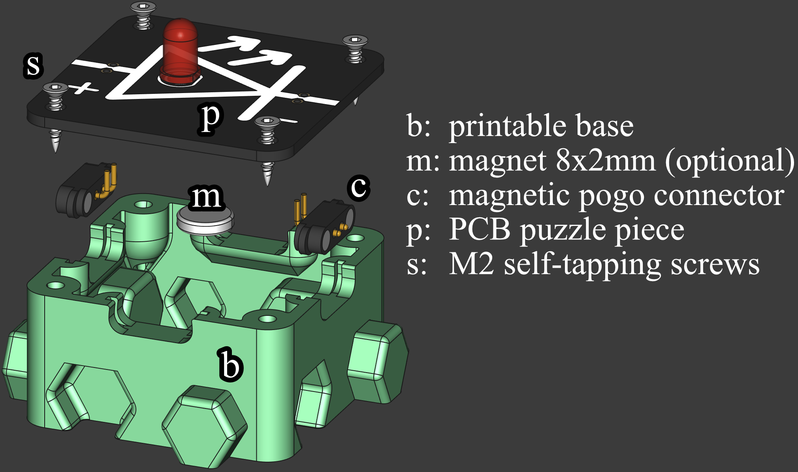

# Circuit Nodes - Modular Electronics Building Blocks

Circuit Nodes is an CC licenced educational tool designed to help students understand electronic circuits by physically building them. 
Each module consists of a small PCB mounted on a 3D-printed base with puzzle-like notches, allowing users to create circuits in a grid-based structure. 
The PCBs include simple circuit elements such as resistors, capacitors, wire traces, switches, LEDs, lamps, and voltage or current measurement points, with their schematic representations printed directly on them. 
Magnetic connectors enable both physical attachment and electrical connection.

This system provides a low-cost entry point into electronics education while remaining scalable. 
By starting with basic components and expanding into more complex circuits, learners of all levels can benefit. 
The pedagogical value lies in reinforcing the connection between abstract circuit diagrams and tangible, working implementations, 
making theoretical concepts easier to grasp through hands-on experimentation.

# Features

*If you are an educator or represent a school interested in testing Circuit
Nodes, I can provide kits for evaluation and classroom use. Please reach out for
more details, see below*

-   Modular Design: 40x40mm PCBs mounted on 3D-printed bases with interlocking
    puzzle-like edges.
-   Hands-on Learning: Users assemble working circuits based on schematic
    diagrams.
-   Magnetic Connectors: Ensure secure physical and electrical connections.
-   Visual Representation: Each PCB features the corresponding circuit schematic
    for intuitive learning.
-   Expandable: Additional modules with more components can be designed and
    added.
-   Low Cost & Scalable: An affordable introduction to electronics that can be
    expanded as needed.

-   Pre-Assembled Kits Available: If the initial effort of manufacturing and
    assembling the components seems too high, I can provide ready-made circuit
    kits to make getting started easier.

# Getting Started, Assembly Instructions

- Refer to the repository contents below for a dedicated list and example circuits. 
- Plan what puzzle pieces you need and how many. An entry electronics kit for school settings needs less than 40 to cover most grounds.
- Download the necessary Gerber files for the circuits or kits you want to build from this repository.
- Manufacture the PCBs using your preferred(accessible) PCB fabrication service. 
  - Talk to the manufacturer if they can provide discounts for educational purpose. 
  - I recommend black background/solder mask and white silkscreen print. From my experience, this combination is the most durable combination.

-   **Decide which style of the 3D printable base you prefer for your scenario**:
    -  PCBs support screws of size M2, M2.3, and M2.6 self-tapping, as well as M2, M2.5 and M3 normal screws in combination with heat inserts.
        -   *Self-Tapping*: I recommend **M2 self-tapping and countersunk**
            screws. They provide the cleanest look, do not require additional
            assembly steps and auto-align the PCBs.
            Self-tapping screws, **can carve multiple threads when reinserting**, limited number of reuse of printable base.
        -   *Heat insert version*: Heat inserts provide **more durable and reliable way** for normal M2 and M2.5, 
            but requires time-consuming melting in the heat inserts with a solder iron or heat insert press.
    -   **Base Bottom Style**:
        -   The *magnetic bottom* base has highest build plate adhesion and allows for installing neodymium magnet, 
            so that the part can be attached to a magnetic surface. The internal height for components will be reduced by approx 3mm down to approx 16mm.
            **This makes a good teacher set for blackboards and whiteboards**
        -   The *skeletonized* one allows to look inside, but prevents curious
            fingers to get inside to accidentally break parts but allows exploring how
            components look in real life.
        -   The *open bottom* uses the least amount of material, is the fastest to
            print and, in case of a damaged component, the bottom side can be
            reached with a solder iron for *repair without disassembly*.            

-   **Before you go mass printing the base parts**, check which tolerance class,
    0.15mm and 0.2mm, suits your printer capabilities. 
    - The puzzle pieces should fit in together without a lot of wiggle room and without a lot of friction.
    - Smallest tolerance is preferred for best alignment of the parts.
-   Solder the component of the schematic of the PCB onto it first.
-   Assemble the puzzle pieces by placing the magnetic connectors in the pockets
    for the dedicated PCBs first. Slots without electrical connection stay     empty.
-   Place the PCB on top of the pins of the magnetic connectors and screw in
    four screws into the base. Screws should auto-center the PCB on the base.
-   Solder the magnetic connectors to the PCB.
-   Start building and experimenting with different circuit configurations!

You can also contact me for production and sale, I stock the puzzle pieces in my inventory and do quality checks including all other parts for assembly.

# Contributing

Contributions are welcome! Feel free to submit pull requests with new module
designs, improvements, or documentation updates. If you are a teacher and would
like to see specific schematics that align with your curriculum, but lack the
KiCAD skills to design them, I am happy to assist with the schematic design
process. Just reach out with your requirements, and I can help bring them to
life for your students.

# Contact

For questions or collaboration, please open an discussion or reach out to me.

# License

This project is licensed under the Creative Commons Attribution-ShareAlike (CC
BY-SA) Non-Commercial license. You are free to share and adapt the designs as
long as you provide attribution and distribute any modifications under the same
license. Commercial use is not permitted.

This work is licensed under a [Creative Commons
Attribution-NonCommercial-ShareAlike 4.0 International
License](http://creativecommons.org/licenses/by-nc-sa/4.0/).

