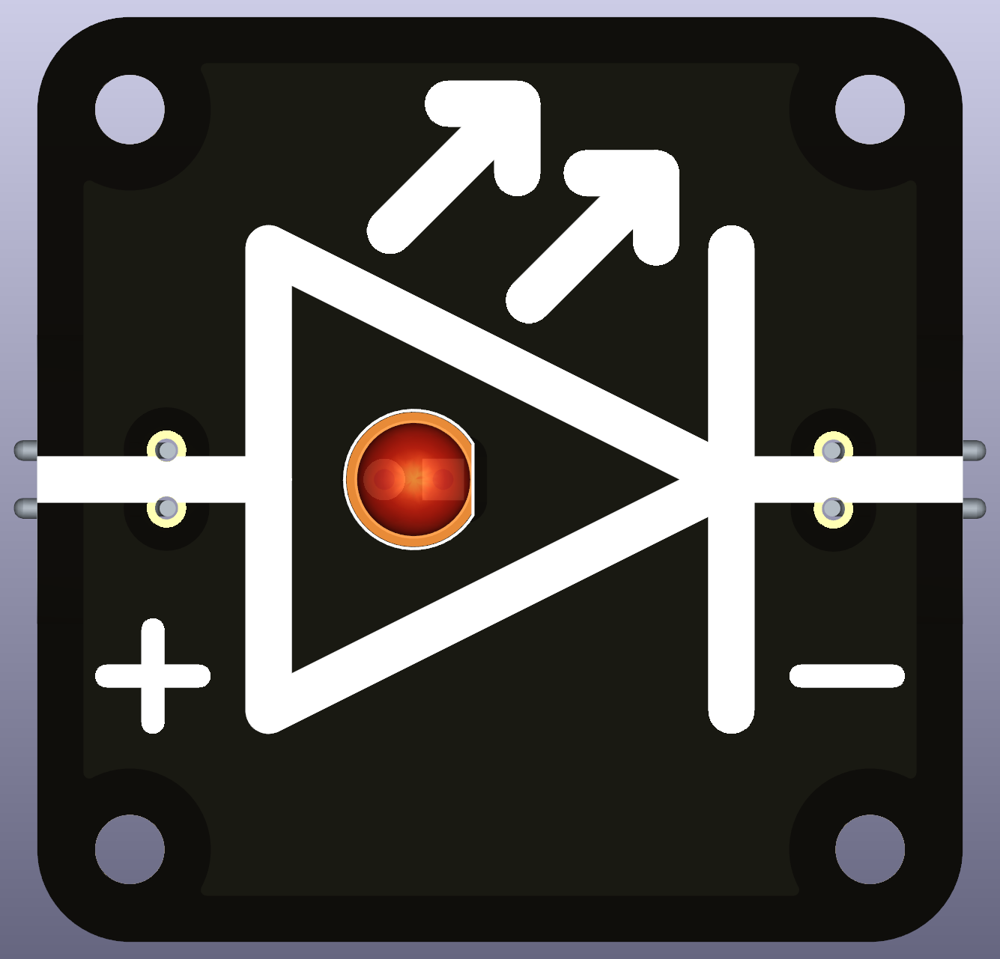
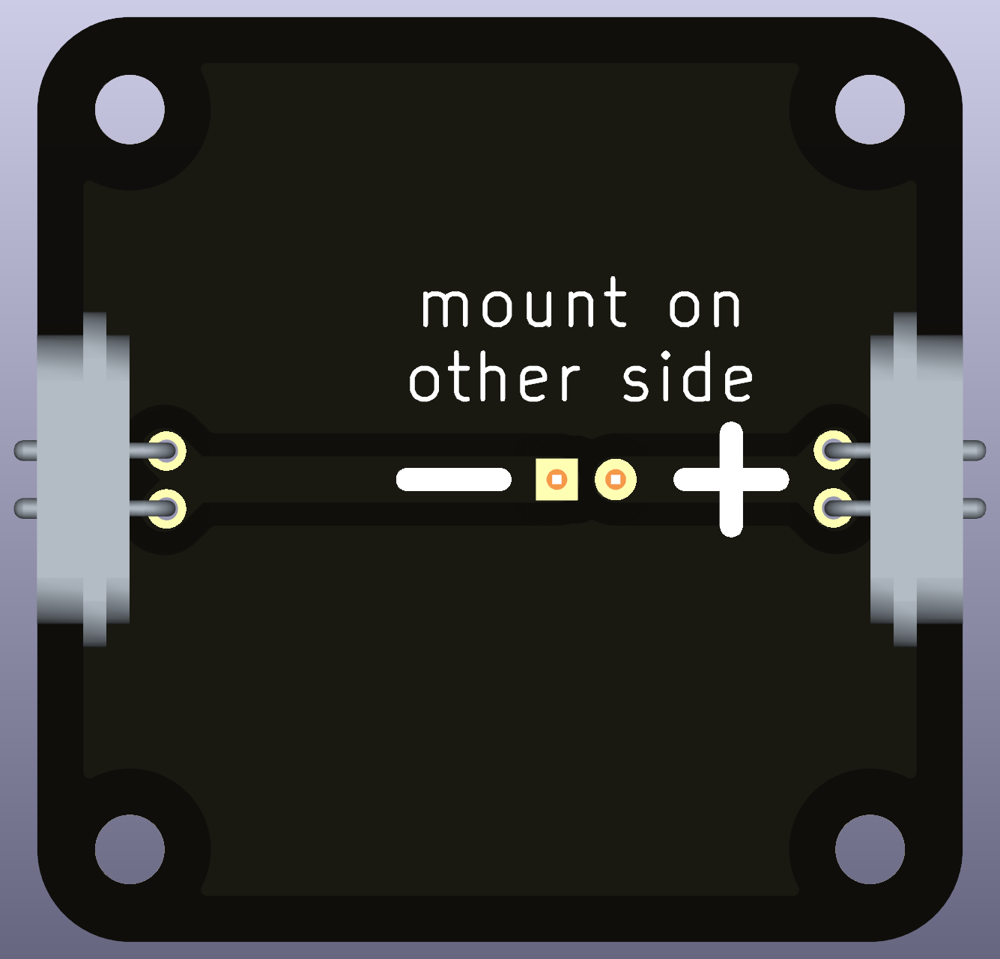

# Intro  
An **LED (Light-Emitting Diode)** is a special type of diode that emits light when electric current flows through it. Unlike regular light bulbs, LEDs are highly efficient and long-lasting.  

 

LEDs only allow current to flow in **one direction** (from the **Anode (+)** to the **Cathode (-)**). They require **a resistor in series** to limit current and prevent damage.  

---

# For What It Is Used  
**LEDs are widely used in:**  
- **Indicators & Displays:** Power/status lights, digital displays.  
- **Lighting:** Energy-efficient bulbs, automotive lighting.  
- **Optoelectronics:** Infrared (IR) LEDs in remote controls, fiber optics.  

## Advantages of LEDs  
✅ **Energy-Efficient:** Uses much less power than incandescent bulbs.  
✅ **Long-Lasting:** Lifespan of tens of thousands of hours.  
✅ **Fast Switching:** Can turn on/off in nanoseconds (used in high-speed communication).  

---

# Functional Description  

An **LED behaves like a one-way valve for electricity** that also emits light when current flows through it.  

## The Two Terminals and Their Roles  

| **LED (Electricity)** | **Water Analogy (Hydrodynamics)** |
|----------------------|----------------------------------|
| **Anode (+)** → Where current enters | **Water pipe inlet** |
| **Cathode (-)** → Where current exits | **Water pipe outlet** |
| **Forward Voltage (Vf)** → Minimum voltage required to turn on | **Minimum water pressure needed to push water through a valve** |

## How It Works  
- **Voltage below Vf (OFF state):**  
  - The LED **blocks current**, just like a closed valve stopping water flow.  
- **Voltage above Vf (ON state):**  
  - The LED allows current to flow and emits light, like a valve opening to let water pass.  

### Typical forward voltage (Vf) values:  
- **Red LEDs:** ~1.8V – 2.2V  
- **Green LEDs:** ~2.0V – 3.2V  
- **Blue/White LEDs:** ~3.0V – 3.5V  

---

# How to Choose the Right Resistor for an LED  

**Current Limiting Required!**  
LEDs must be used with a **series resistor** to prevent excessive current.  
The resistor value can be calculated using Ohm’s Law:  

R = (Vsupply - Vf) / I

where:  
- `R` = Resistor value (Ω)  
- `Vsupply` = Supply voltage (V)  
- `Vf` = LED forward voltage (V)  
- `I` = Desired LED current (A) (typically 10-20mA for small LEDs)  

Example for a **5V supply and red LED (Vf = 2V, I = 10mA)**:  

Use the next standard resistor value: **330Ω**.  

---

# Important Considerations  

⚠️ **LED Polarity:** LEDs **only work in one direction** (Anode to Cathode).  
⚠️ **Too Much Current Kills LEDs:** Always use a **series resistor** or current-limiting circuit.  
⚠️ **Brightness vs. Current:** More current makes LEDs brighter, but too much reduces lifespan.  
⚠️ **Parallel LEDs Need Individual Resistors:** Otherwise, uneven brightness or failure may occur.  

---

# Common Types of LEDs  

| **Type** | **Description** | **Use Cases** |
|----------|---------------|---------------|
| **Standard 5mm LED** | Common indicator LED | Status lights, basic circuits |
| **High-Power LED** | Bright, high-efficiency | Flashlights, automotive lighting |
| **RGB LED** | Can emit multiple colors | Displays, decorative lighting |
| **Infrared (IR) LED** | Emits invisible infrared light | Remote controls, sensors |

---

# Compatible and Recommended Part(s)  
For general-purpose use, the following LEDs are common:  
- **5mm Red LED (1.8V – 2.2V, 10-20mA)** – Basic indicator LED.  
- **WS2812B (Addressable RGB LED)** – Controllable with microcontrollers.  
- **High-Power White LED (3W – 10W)** – Used for lighting applications.  

When using LEDs, always check:  
- **Forward voltage (Vf)**  
- **Current rating (mA or A)**  
- **Required resistor for current limiting**  
