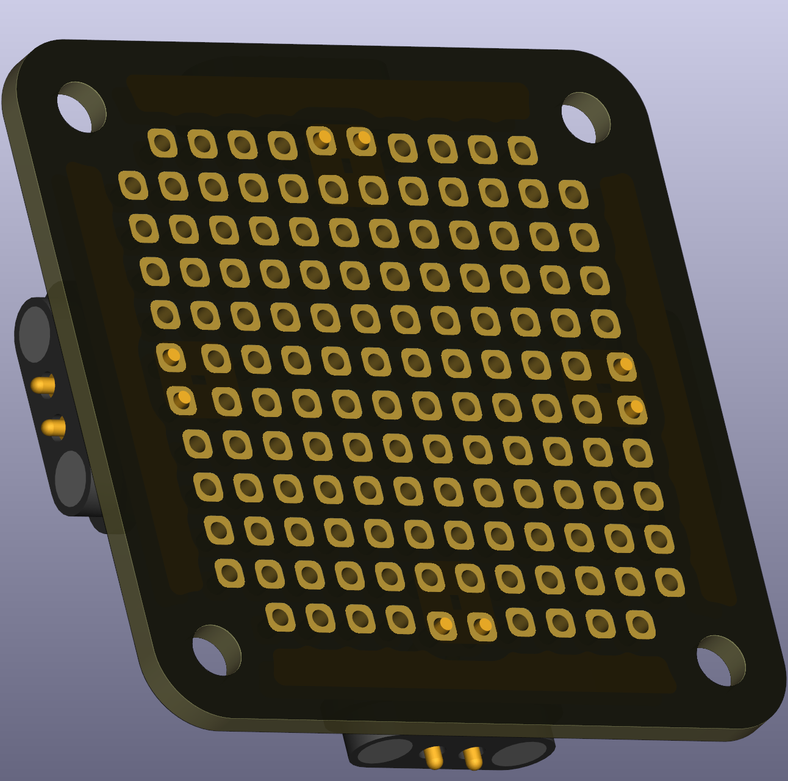
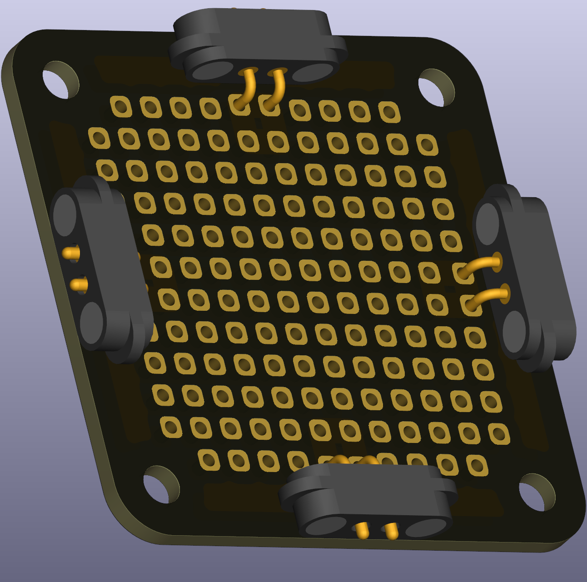

# Breadboard grid (2.54 mm, 1×1)

This breadboard grid provides 2.54 mm spacing in a compact 1×1 layout for small prototypes and classroom exercises. It is useful when students need a small area to solder or test circuits while keeping components organised.

 

## Typical uses in circuits
- Small soldered circuits and stand-in for a full-size prototyping board.

## Practical and safety notes
- Use low voltages for classroom work and avoid mains-level experiments on these small boards.

