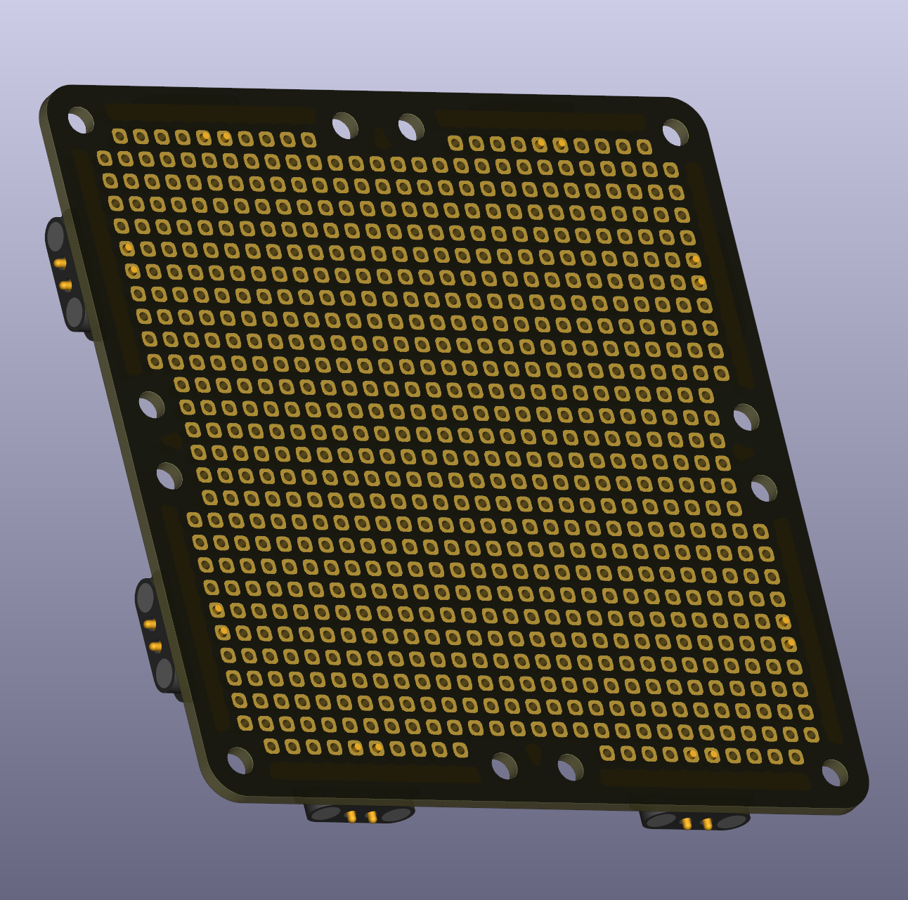
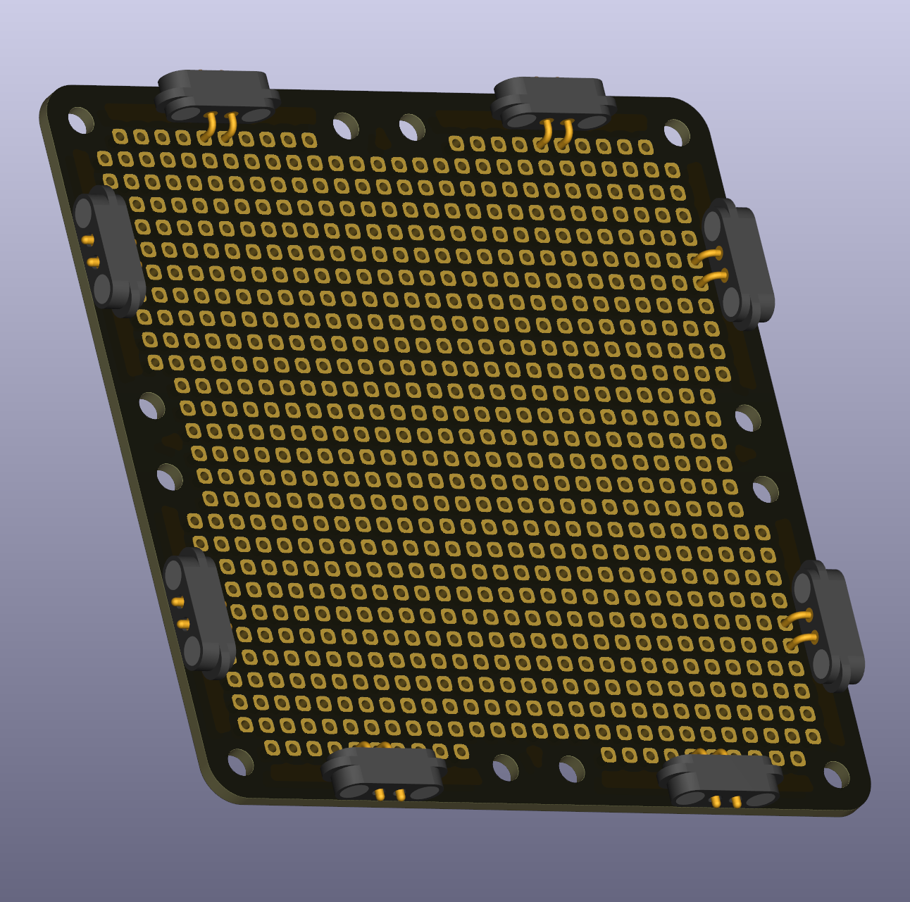

# Breadboard Grid 2×2 (2.54 mm Spacing)

This puzzle piece is a generic breadboard grid with 2.54 mm spacing—the standard spacing used in most hobbyist electronics. It serves as a placeholder for building more complex custom circuits that don't fit neatly into predefined puzzle pieces. You can solder your own components directly onto this breadboard area. It exists in various sizes (1×1, 1×2, 2×2, and larger).

The square holes have rounded corners, which accommodates not only traditional through-hole parts but also larger SMT (surface-mount technology) components, though the holes are optimized for through-hole use.

 
