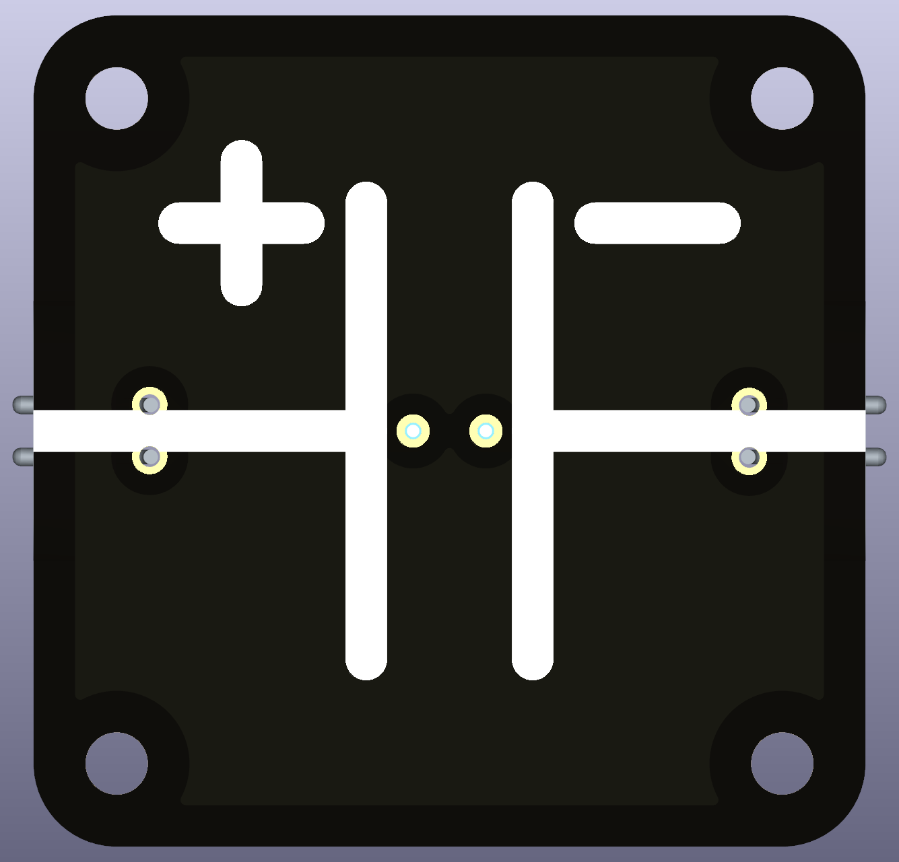
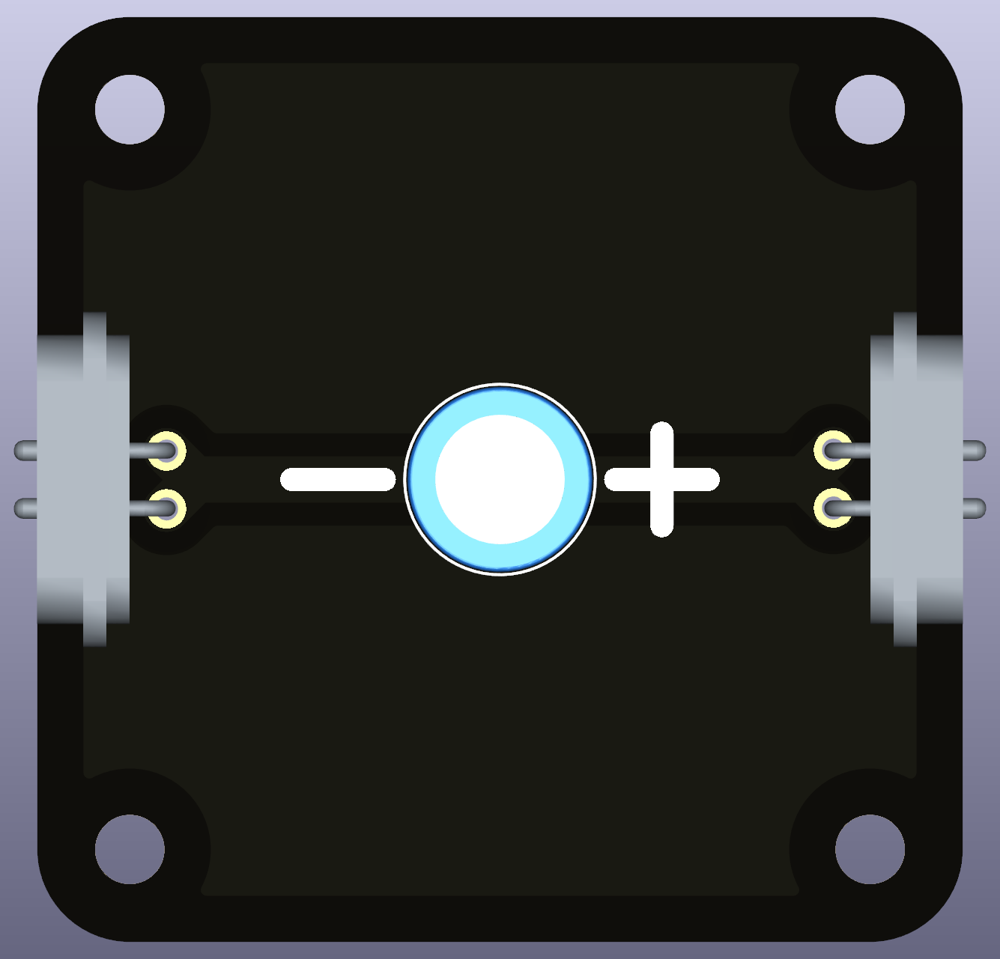

# Intro  
A **polarized capacitor** is an electronic component that **stores and releases electrical energy**. It is used in circuits to smooth out voltage, filter signals, and store energy for brief periods.  
Unlike regular capacitors, **polarized capacitors have a positive (+) and a negative (-) side**, meaning they must be connected in the correct orientation.  

 

# Advantages of Polarized Capacitors  
* **High capacitance:** Can store more energy than non-polarized capacitors of the same size.  
* **Reliable for energy buffering:** Helps stabilize voltage in circuits.  

# Important Considerations  

⚠️ **Polarity Matters!** If connected **backwards**, a polarized capacitor **may overheat, leak, or even explode**. 
⚠️ **Voltage Rating:** The capacitor’s voltage rating **must be higher than the circuit voltage** to avoid failure. 

# Compatible and Recommended Part(s)  
Any standing THT capacitor will be compatible, but the capacity should be selected for appropriate use.

* **slow** charging and discharging is best to illustrate with larger capacity and larger in-series resistor, so standard multimeter can follow to slow voltage and current change. The time scale for charging, RC time constant, is $\tau = RC$. After $1\tau$, the capacitor is 37% charged, after $2\tau$ 87% and $3\tau$ 95%. As example, $100 \text{µF}$ and $1 \text{M}\Omega$ results in a RC time constant of 100 seconds. The capacitor needs approx 5 minutes to charge 95%!

* **too high capacity** can be dangerous (in school settings). Shorting a charged, large capacitor can cause huge current surges. 
