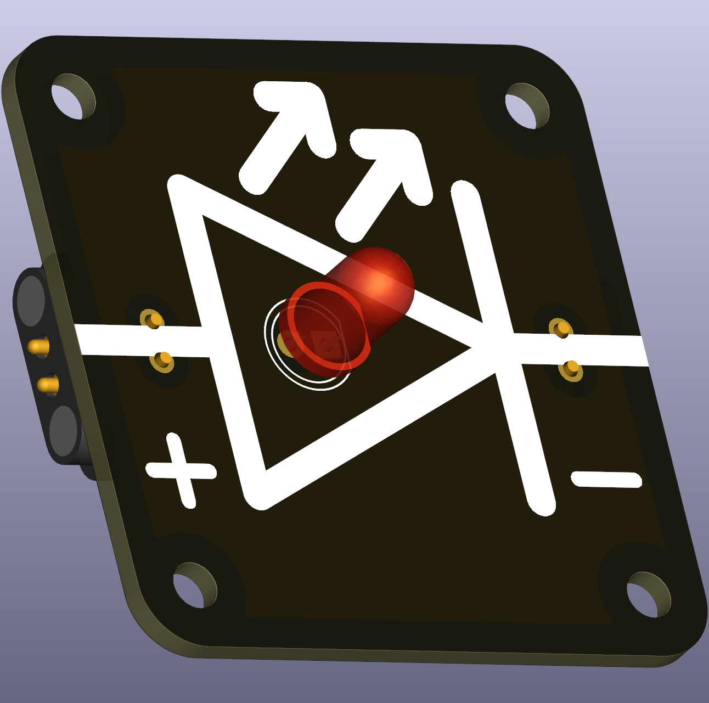
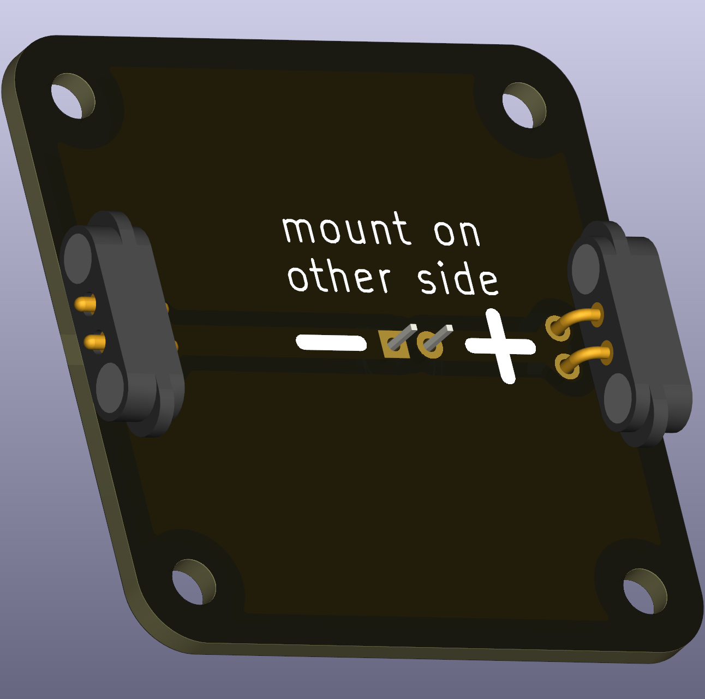

# LED (THT)

An LED (light-emitting diode) produces light when a current flows in the forward direction. LEDs are efficient and durable, but must be used with current limiting to avoid damage.

 

## Typical uses in circuits
- Visual indicators for power, logic states, or sensor output in classroom projects.

## Typical forward voltages (approx.)
- Red: ~1.6 – 2.0 V
- Orange: ~2.0 – 2.1 V
- Yellow: ~2.1 – 2.2 V
- Green: ~2.2 – 3.2 V
- Blue/White: ~3.0 – 3.5 V

## Practical notes and current limiting
- Always use a series resistor. Calculate the resistor with Ohm’s law:

\[R = \frac{V_{\text{supply}} - V_{\text{forward}}}{I_{\text{desired}}}\]

- Typical 5 mm THT LEDs are used at 10–20 mA; choose resistor values and supply voltages appropriate for the chosen LED.

## Mounting variant
- This README covers the soldered THT variant. For easy swapping of LEDs see the replacable SMT/pass-through variation in the project.
