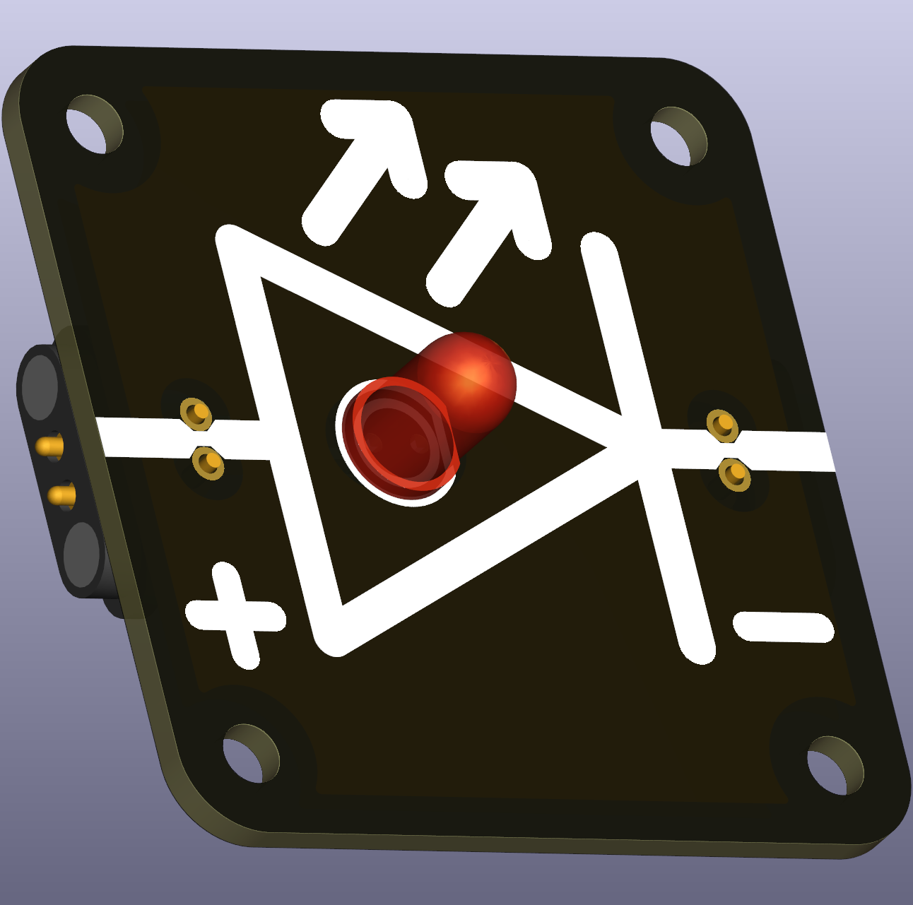

# Intro  
An **LED (Light-Emitting Diode)** is a special type of diode that emits light when electric current flows through it. Unlike regular light bulbs, LEDs are highly efficient and long-lasting. Their downside is their limited voltage and current range they can function.

 

**This replacable version uses SMT pass-through 2.54mm header as a make-shift holder for THT LEDs** Standard 5mm LEDs will match the pitch of the header, 2.5mm, and make contact with the header terminals on the other side. Large 10mm LEDs usually fit, too. Note: the leads of THT LEDs are usually quite long. Therefore, it is recommended to shorten them beforehand and also keeping the notation of anode and cathode intact (one leg is shorter than the other).

LEDs only allow current to flow in **one direction** (from the **Anode (+)** to the **Cathode (-)**). They require **a resistor in series** to limit current and prevent damage.  

# Typical forward voltage values:  
- **Red:** ~1.6 – 2.0V  
- **Orange:** ~2.0 - 2.1V
- **Yellow:** ~2.1 - 2.2V
- **Green:** ~2.2V – 3.2V  
- **Blue/White:** ~3.0V – 3.5V  

# Current Limiting Required
LEDs must be used with a **series resistor** to prevent excessive current.  
The resistor value can be calculated using Ohm’s Law:  

\[R = \frac{V_\text{supply} - V_\text{forward}}{I_\text{max,LED}}\]

It is recommended to use a supply voltage that is in the range of the forward voltage of the LED, otherwise large resistors (with large heat dissipation) are required. LEDs with current-limiting resistors are typically supplied with 5V. Standard 5mm THT LEDs have a maximum current of 20mA. Thus, a resistor around 
