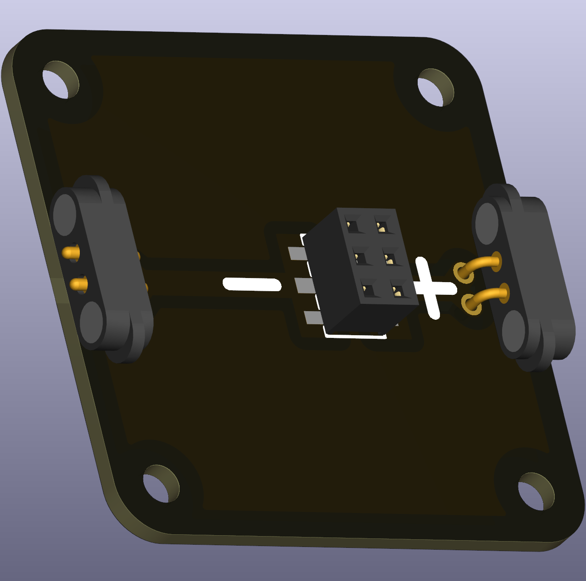

# LED (replacable THT via SMT header)

This variant uses an SMT pass-through header so through-hole LEDs can be plugged in and removed without desoldering. It is convenient for classroom kits where learners swap LEDs frequently.

 

## Typical uses in circuits
- Rapid prototyping and demonstration setups where LED swapping is useful.

## Practical notes
- Shorten long LED leads before inserting to avoid mechanical stress.
- Observe polarity: the shorter leg is usually the cathode.
- Use a series resistor; calculate with Ohm’s law:

\[R = \frac{V_{\text{supply}} - V_{\text{forward}}}{I_{\text{desired}}}\]

The resistor value can be calculated using Ohm’s Law:  
