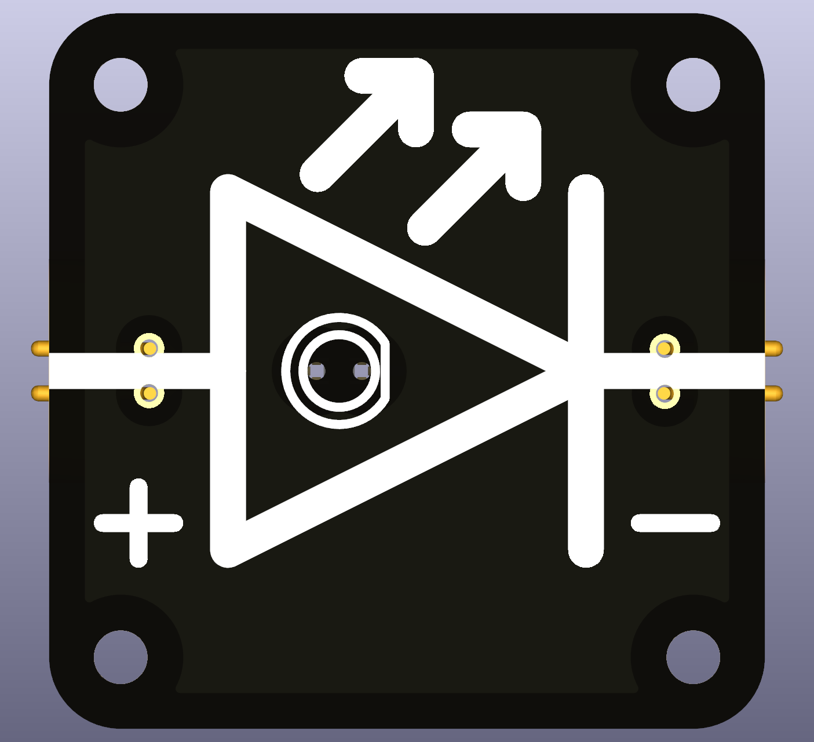

# Intro  
An **LED (Light-Emitting Diode)** is a special type of diode that emits light when electric current flows through it. Unlike regular light bulbs, LEDs are highly efficient and long-lasting. Their downside is their limited voltage and current range they can function.

 

**This replacable version uses SMT pass-through 2.54mm header.** Standard 5mm LEDs will match the pitch of the header and make contact with the header terminals on the other side.Note: the leads of THT LEDs are usually quite long, longer than the height of the Circuite Node. Therefore, it is recommended to shorten them beforehand and also keeping the notation of anode and cathode intact.

LEDs only allow current to flow in **one direction** (from the **Anode (+)** to the **Cathode (-)**). They require **a resistor in series** to limit current and prevent damage.  

## How It Works  
- **Voltage below V_forward (OFF state):**  
  - The LED **blocks current**, just like a closed valve stopping water flow.  
- **Voltage above V_forward (ON state):**  
  - The LED allows current to flow and emits light, like a valve opening to let water pass.  

## Typical forward voltage (Vf) values:  
- **Red:** ~1.6 – 2.0V  
- **Orange:** ~2.0 - 2.1V
- **Yellow:** ~2.1 - 2.2V
- **Green:** ~2.2V – 3.2V  
- **Blue/White:** ~3.0V – 3.5V  

**Current Limiting Required!**  
LEDs must be used with a **series resistor** to prevent excessive current.  
The resistor value can be calculated using Ohm’s Law:  

R = (Vsupply - Vf) / I

where:  
- `R` = Resistor value (Ω)  
- `Vsupply` = Supply voltage (V)  
- `Vf` = LED forward voltage (V)  
- `I` = Desired LED current (A) (typically 10-20mA for small LEDs)  
