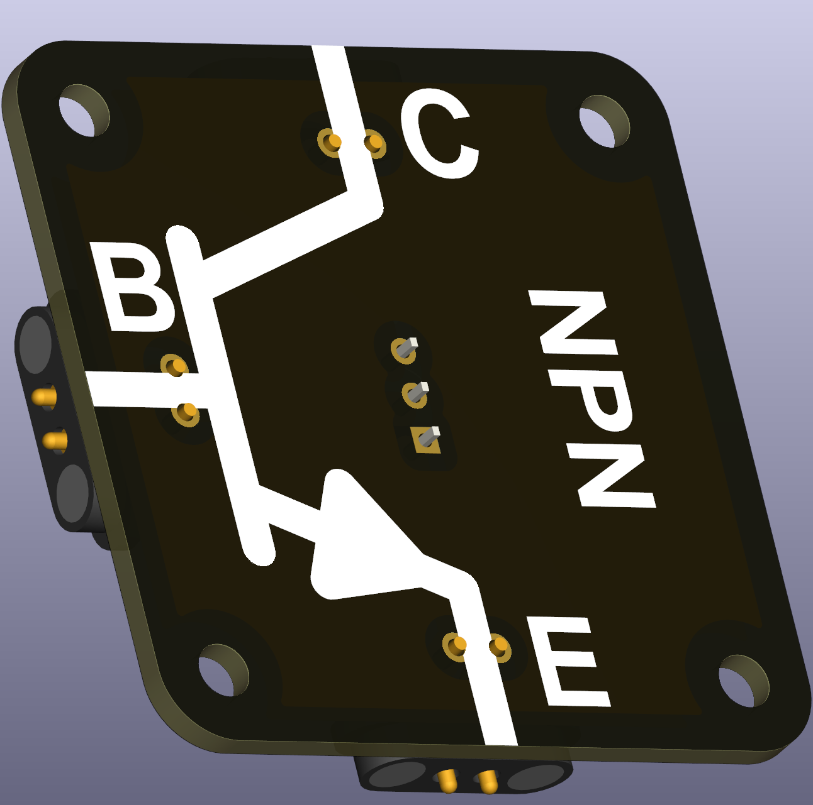
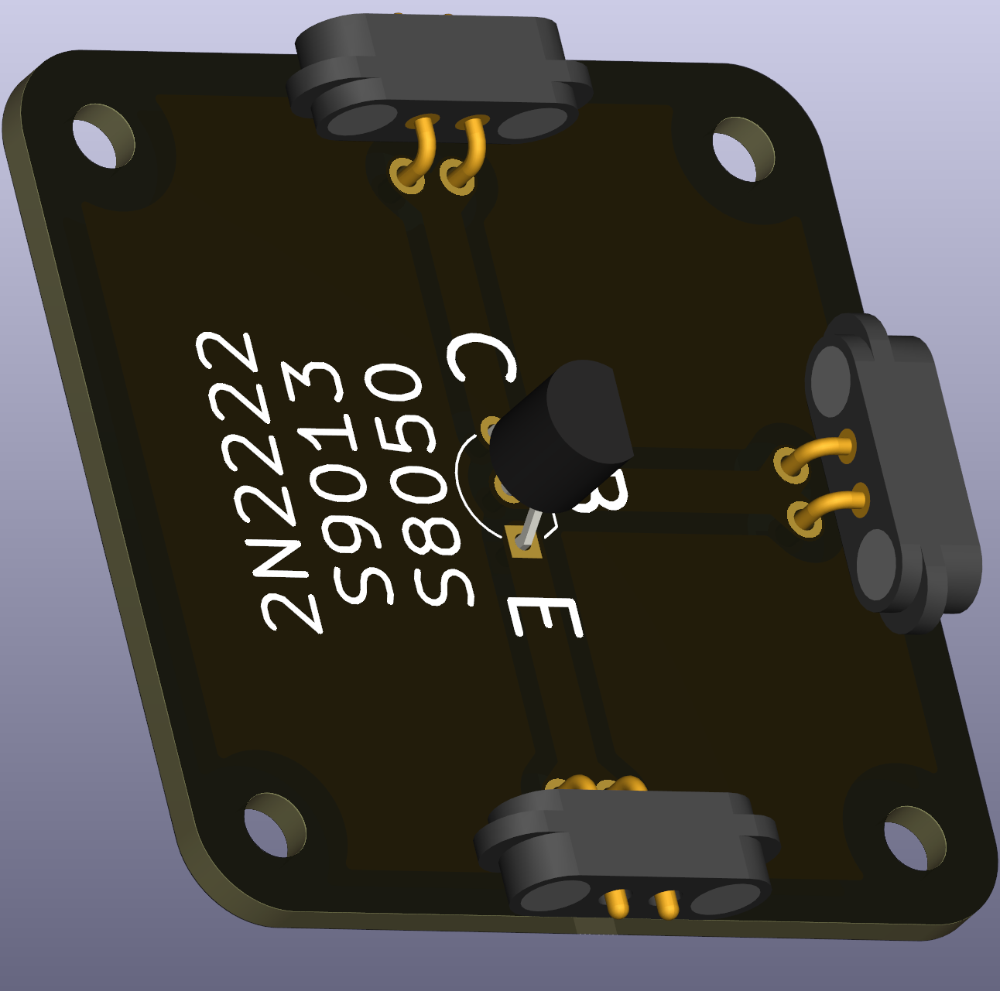

# NPN Bipolar Junction Transistor (TO-92)

An NPN BJT controls a larger current using a smaller base current and is commonly used in switching and low-power amplification tasks. It is a useful device to teach the difference between current-driven and voltage-driven control.

 

## Functional description
Terminals:

| Terminal | Function |
|---|---|
| Collector (C) | Current enters |
| Emitter (E) | Current exits |
| Base (B) | Controls conduction with small current |

- Base current off: transistor blocks current.  
- Base current present: transistor allows larger collector current to flow.

## Typical uses in circuits
- Low-power switching, small motor control, LED drivers, and introductory amplifier circuits.

## Didactical notes
- Compare BJTs with MOSFETs in lab to show current‑controlled versus voltage‑controlled behaviour and the implications for efficiency and drive circuitry.

## Practical notes and selection
- Check datasheet values such as current gain (h_FE), collector-emitter voltage (V_CE), and maximum collector current (I_C) when choosing parts for experiments.

## Recommended parts
- Common, easy-to-source examples: 2N2222, S9013, S8050.
