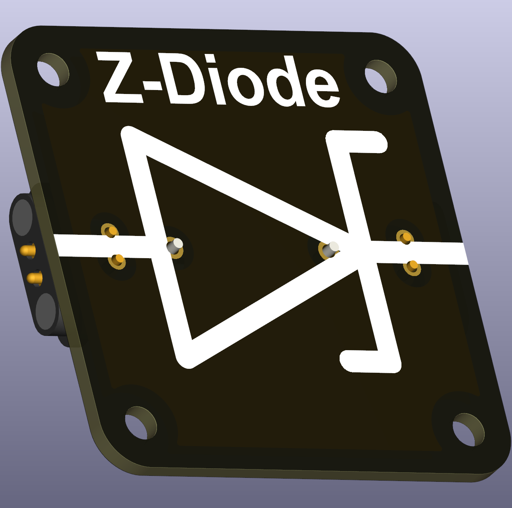

# Intro  
A **Zener-diode** is a special type of diode. In the forward direction, it acts like a normal diode. However, this is not the intended use for this special diode. Unlike regular diodes, the Zener-diode not only allows current to flow in the forward direction but is also engineered to  conduct in the **reverse direction** once a specific reverse voltage — known as the Zener voltage — is reached. This controlled *breakdown mechanism* within the diode maintains a **nearly constant voltage across its terminals** at varying currents, making it ideal for voltage regulation applications.

 

Zener-Diodes allow current to flow in **both directions** (from the **Anode (+)** to the **Cathode (-)**). They require a **resistor in series** to limit current and prevent damage. While a Zener diode can be used as forward direction diodes. Its characteristics are optimized for backward direction, i.e. you place them "the wrong way" in an electric circuit.

# Current Limiting Required
Diodes must be used with a **series resistor** to prevent excessive current. 
The resistor value can be calculated using Ohm’s Law:  

\[R = \frac{V_\text{supply} - V_\text{Zener}}{I_\text{max,diode}}\]

Oftentimes, the maximum heat dissipation is used as reference, i.e. 1W.

Diodes have a maximum current based on their package size (effective dissipation capacity). Diodes with DO-35 package have maximum current of approx. 0.2A and DO-41 1A, etc.

# Recommended Parts

Many Zener diodes will work with this part. The recommended package size is DO-41 (or larger), as the maximum heat dissipation is approx 1W. One standard diode is the 1N47xxA series, ranging from xx = 28 for a Zener voltage of 3V to xx = 56 for a Zener voltage of 40V (out of the scope of schools!). The number refers to the step in the **E-series**.
