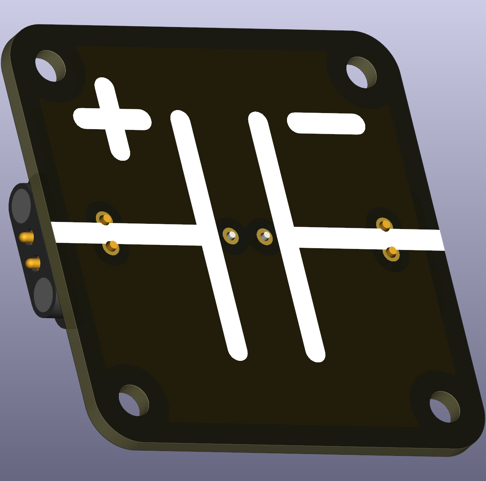
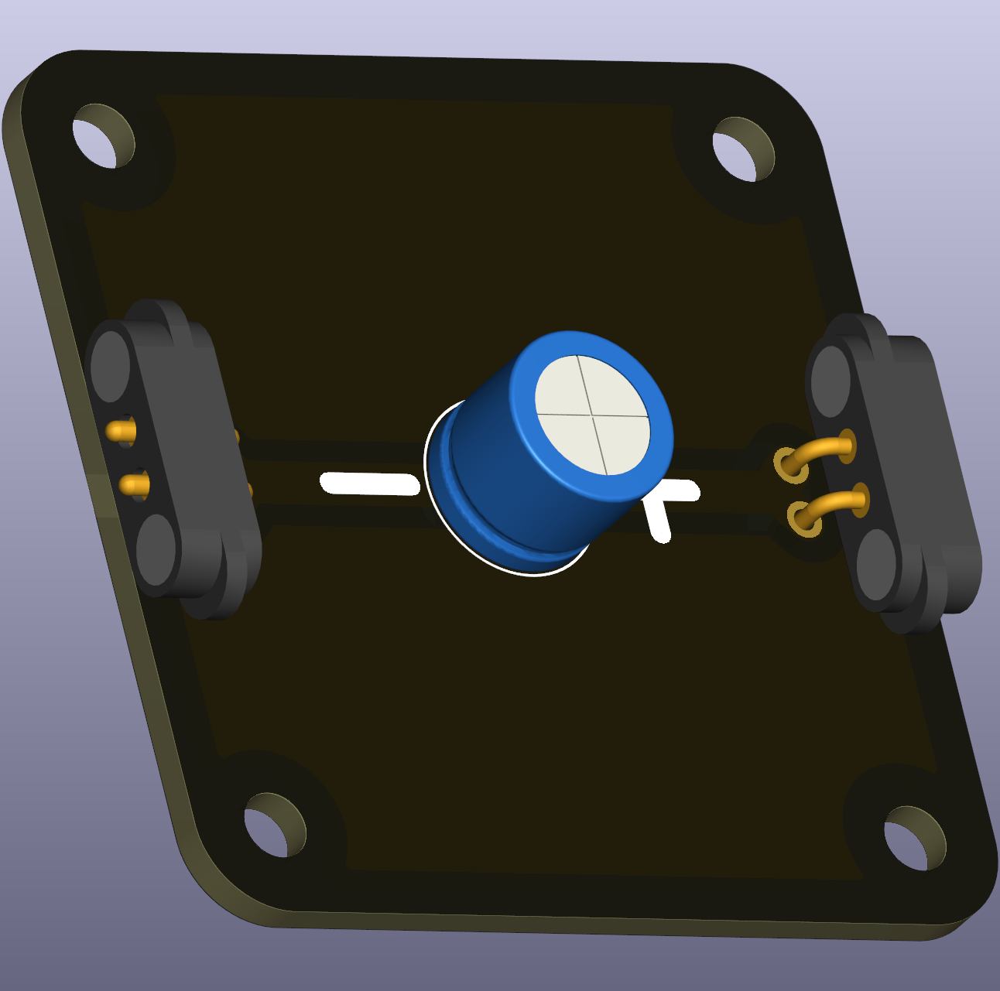

# Polarized capacitor (THT)

A polarized capacitor stores electrical energy and releases it when needed. It is commonly used for smoothing supply voltages, filtering signals, and temporary energy storage. Polarized capacitors have a defined positive (+) and negative (−) terminal and must be inserted with correct polarity.

 

## Typical uses in circuits
- Smoothing supply ripple in simple power supplies.
- Coupling or decoupling in sensor and amplifier circuits.
- Demonstrating RC charging/discharging experiments.

## Didactical notes
- Use this component to show the difference between polarized and non-polarized capacitors and to run RC time-constant experiments. Measure voltage over time and compare against the expected exponential curve.

## Practical and safety notes
- Polarity: inserting the capacitor reversed can cause heating or rupture. Always mark and check the polarity before powering.
- Voltage rating: choose a capacitor with a voltage rating higher than the maximum circuit voltage.
- Energy and short circuits: large-value capacitors store more energy; avoid shorting charged capacitors in class experiments.
