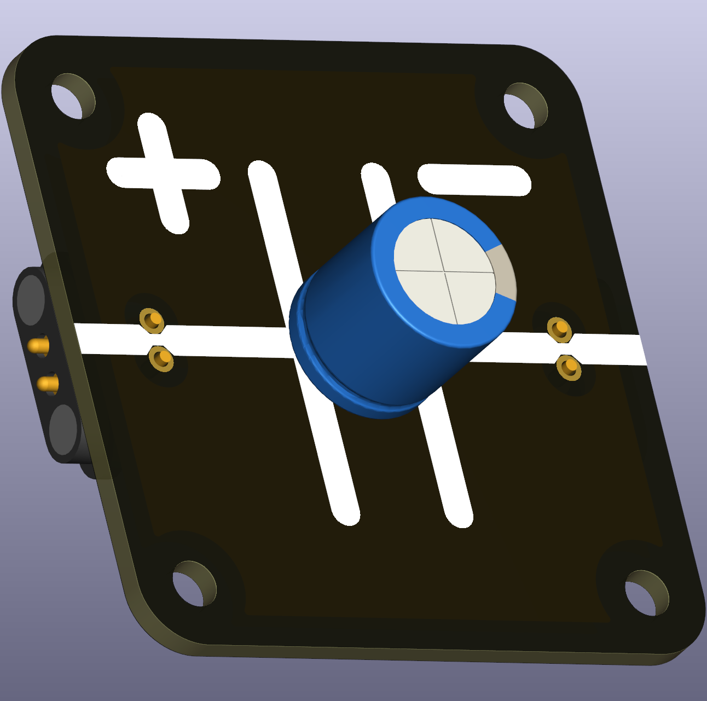

# Polarized capacitor (replacable THT)

This variant provides a replaceable THT capacitor mounted via a pass-through header. It comes in 2.5 mm or 5 mm lead spacing to accept different capacitor sizes. It is convenient for classroom kits where capacitors may be swapped during experiments.

  **OR** 

## Typical uses in circuits
- Easy replacement of capacitors for experiments with different time constants or smoothing behaviours.

## Didactical notes
- Useful for RC charging/discharging demonstrations and for letting students compare different capacitances without soldering.

## Practical and safety notes
- Observe polarity when inserting capacitors and choose an appropriate voltage rating.
- Larger capacitances store more energy; avoid shorting charged capacitors and supervise experiments involving large energy storage.