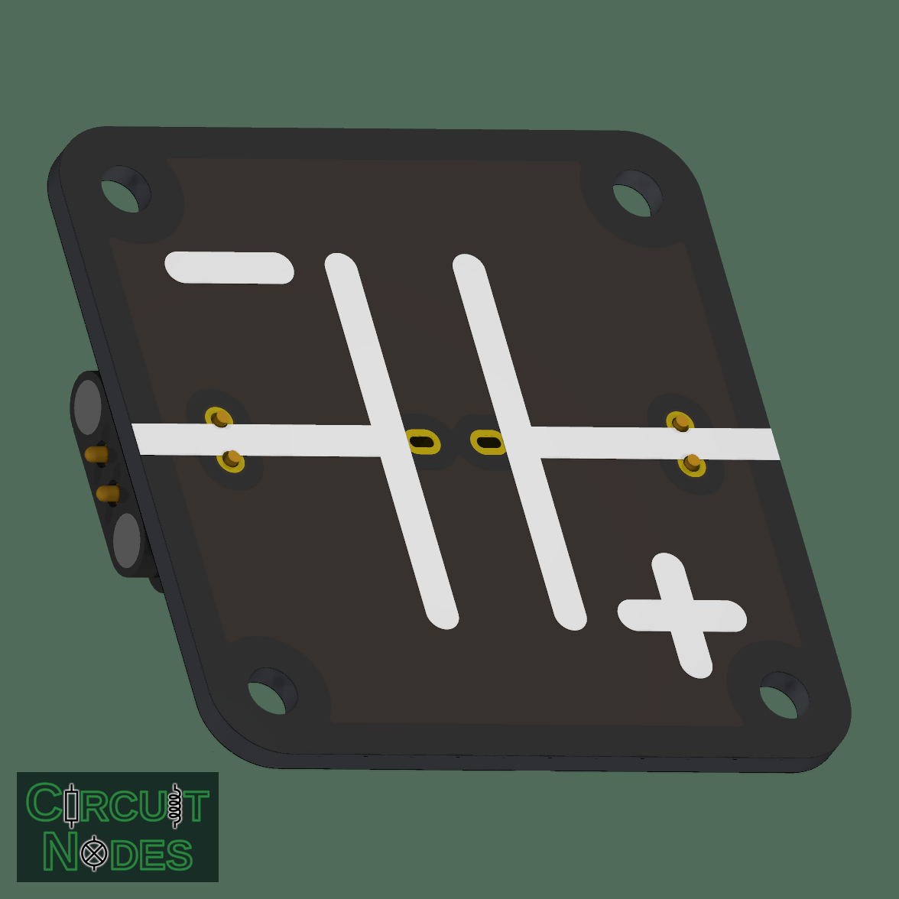
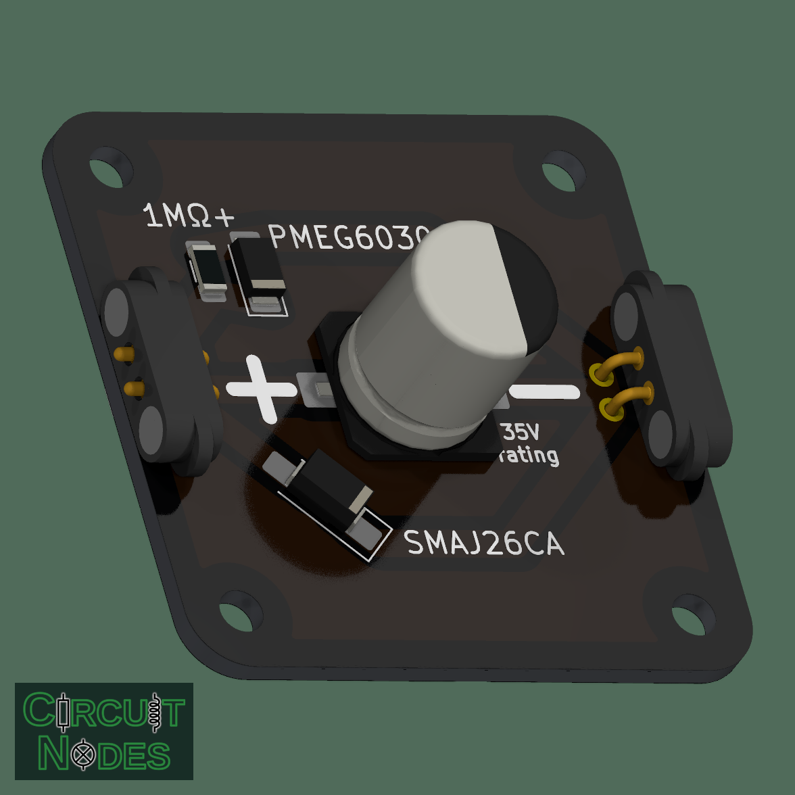

# Polarized capacitor (ruggedized)

This 40 x 40 mm module supports classroom experiments with charge storage, supply smoothing, and RC circuits. Optional reverse-polarity and transient-voltage protection, plus a discharge resistor, make it more tolerant of wiring mistakes. Use a suitably rated capacitor and a current-limited supply.

 

## Circuit and assembly options

The capacitor and optional protection/discharge parts share the same positive and negative terminals.

| Reference | Part or footprint | Function |
| --- | --- | --- |
| C1 | Radial THT capacitor, 8 mm body, slotted holes for 3.5 mm or 5 mm lead spacing | THT assembly option |
| C2 | SMD electrolytic capacitor, 10 x 12.5 mm footprint | SMD assembly option |
| D1 | SMAJ26CA, SMA | Bidirectional TVS diode for transient-voltage suppression |
| D2 | PMEG6030, SOD-128 | Schottky diode across the terminals to limit reverse voltage |
| R1 | 1 MΩ, 1206 | Bleeder resistor to discharge the capacitor after disconnection |

**Fit either a THT or SMD capacitor, never both:** their footprints overlap. The component-face image shows the SMD option. Choose capacitance for the intended experiment and check that the capacitor fits inside the base.

**Every protection/discharge component is independently optional.** Fit any combination of D1, D2, and R1, or omit all three for a plain capacitor module. These parallel branches need no bridges or jumpers when omitted.

- **D1:** suppresses short voltage transients, but not sustained overvoltage.
- **D2:** conducts during reversed connection to limit reverse voltage. It does not disconnect the supply; upstream current limiting is required.
- **R1:** gradually drains residual charge. It does not limit short-circuit current or discharge the capacitor immediately.

## Typical uses and teaching notes

- Demonstrate capacitor charging and discharging in an RC circuit.
- Smooth supply ripple or provide local energy storage in a DC circuit.
- Compare this module with and without its optional protection/discharge components.

With R1 fitted and no other load, the nominal discharge time constant is `1 MΩ × C`. External resistors and the voltmeter shorten it. For measurements of slow discharge or capacitor leakage, consider omitting the optional components.

## Choosing a capacitor for teaching

**35 V-rated capacitors are recommended** with the named SMAJ26CA and PMEG6030 diodes, operated within their ratings. This is a capacitor rating, not a recommended supply voltage: keep normal operation below the TVS's 26 V standoff voltage. Its specified peak-pulse clamp voltage is approximately 42.1 V, so it does not guarantee that every transient stays below 35 V.

For an initial RC experiment, consider **220 µF at a 5 V supply**, with an
external **47 kΩ discharge resistor**. This gives roughly a 10-second time
constant, allowing several readings with a basic multimeter.

For slow discharge measurements, choose a **low-leakage electrolytic capacitor**. Leakage comparable to the discharge current makes the measured curve depart from an ideal RC exponential.

### Time constant and measurement

For an ideal discharge, `τ = R_eff C` and `V(t) = V₀ exp(−t/τ)`. After one
time constant the voltage is about 37% of its initial value. Aim for roughly **5–20 seconds per time constant**
for readings taken by hand with an inexpensive multimeter.

When fitted, the module's 1 MΩ bleeder and a voltmeter both load the capacitor:

`R_eff = 1 / (1/R_ext + 1/(1 MΩ) + 1/R_meter)`

If R1 is omitted, omit the `1/(1 MΩ)` term. Diode leakage can also affect slow discharge measurements when D1 or D2 is fitted.

## Operating limits

- Follow the printed + and − markings, even when D2 is fitted.
- Use a current-limited supply or upstream overcurrent protection.
- Avoid shorting a charged capacitor. R1 drains charge gradually; check the terminal voltage before handling or changing components.
