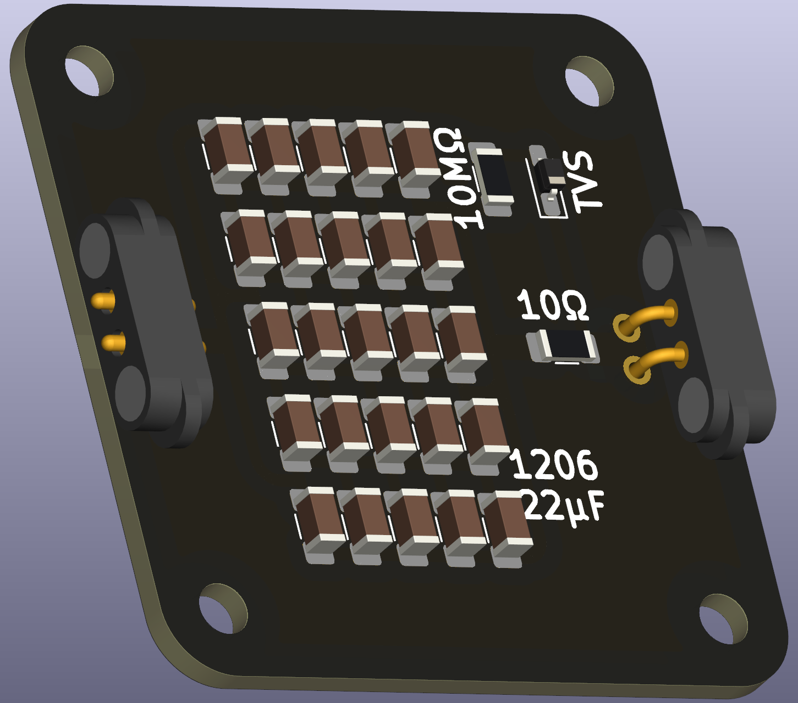

# Unpolarized capacitor (MLCC SMT)

An unpolarized capacitor is agnostic of the applied voltage polarity and stores electrical energy and releases it when needed. It is commonly used for smoothing supply voltages, filtering signals, and temporary energy storage. 

Multi-layer ceramic capacitors (MLCCs) are unpolarized and come with a few pros and cons compared to polar electrolytic capacitors. Being unpolar is a huge upside in educational settings – they cannot be connected wrong and no explosion risk – but usually require many capacitors in parallel for high capacitance and can show aging on decade-long time scales.

 

## Capacitance and Soldering Remarks

The capacitance of parallel capacitors is additive. MLCCs capacitance is DC voltage bias; the higher the DC voltage applied, the lower the effective capacitance gets, relative to the given voltage rating. Further, physically larger capacitors typically have thicker dielectric are are preferred. Lastly, the price per capacitor is increasing non-linearly with its quality. Thus, the recommended capcitors are **1206 22µF 25V**.

Soldering many MLCCs is teadious with a soldering iron! While the component size and spacing is wide enough for a soldering iron, this puzzle piece benefits highly when soldering via a hot plate, i.e. **reflow soldering**. 

## Safety Features

This PCB is ruggedized, i.e. some safety features are included to prevent potential misuse in school settings.

- *In-series resistor*: limiting the charging current to reasonable values that can be handled by the magentic connectors, traces and power supplies
- *bleed resistor*: very slowly discharging the capacitor array when no supply is connected
- *ESD protective diode*: protection "Human Body Model" (HBM) ESD event, up to ±8 kV contact discharge, very fast rise time (ns), low total energy, very high peak current