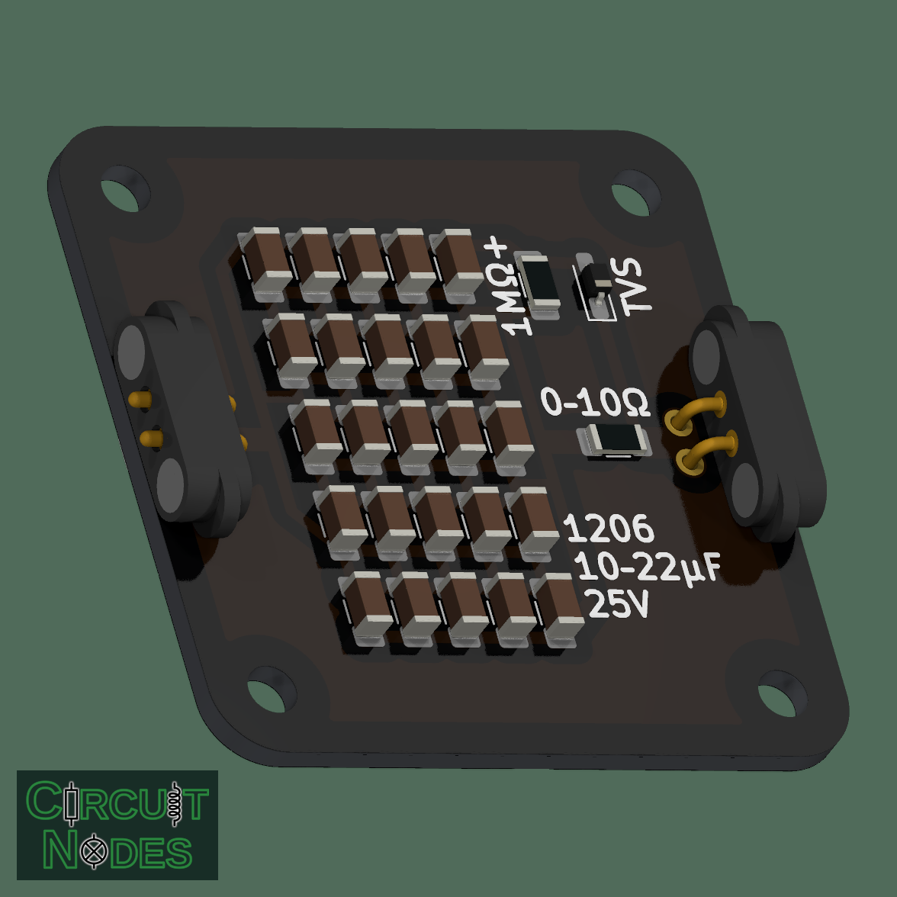

# Unpolarized capacitor (MLCC SMT)

This node uses parallel multilayer ceramic capacitors (MLCCs) for charge storage, filtering, and RC or "slow AC" experiments. Either terminal can be positive.

 

## Capacitance and assembly

The silkscreen specifies **1206, 10–22 µF, 25 V** capacitors. There are 25 parallel positions; populate fewer positions if less capacitance is needed. Empty capacitor positions require no bridges.
The footprints allow hand soldering, but a stencil and reflow process make a fully populated bank much easier to assemble. Fewer populated positions also reduce manual work.

| Population | Nominal total capacitance |
| --- | --- |
| 25 × 10 µF | 250 µF |
| 25 × 22 µF | 550 µF |

## Series resistor: 0–10 Ω

R1 is marked **0–10 Ω**. **10 Ω is the default** to limit connection and charging-current peaks. This resistor does not provide complete fault protection, only current limiting

Fit a **0 Ω link** when bypassing the resistor is appropriate for the experiment, with current limiting provided elsewhere. Leaving R1 unpopulated disconnects the capacitor bank.

For the nominal 550 µF bank, capacitive reactance is approximately 300 Ω at 1 Hz and 3 kΩ at 0.1 Hz. A 10 Ω series resistor therefore has little influence on slow sinusoidal experiments. Abrupt square-wave transitions can still cause current peaks.

## Bleeder resistor: 1 MΩ or greater

R2 is marked **1 MΩ+**, meaning a bleeder resistance of **1 MΩ or greater**. 

Choose the fitted resistance to balance discharge time against loading of the experiment. With the nominal 550 µF bank, the resistor-only time constant `τ = RC` is about **550 seconds at 1 MΩ** or **5,500 seconds at 10 MΩ**. These are gradual discharge paths, not immediate discharge. The capacitors and TVS have also tiny internal leaking paths, so the effective bleed resistance is likely approx. 0.5–2 MΩ.

## Transient protection and operating notes

D1, marked **TVS**, is the bidirectional ESD protection device , e.g. Nexperia **PESD1IVN24-A**. It suppresses brief transients; it is not a regulator or protection against sustained overvoltage.

Use voltages within the ratings of the fitted parts and limit source current. Disconnect the supply and check the terminal voltage before changing connections or handling the board. Avoid shorting the charged bank.
