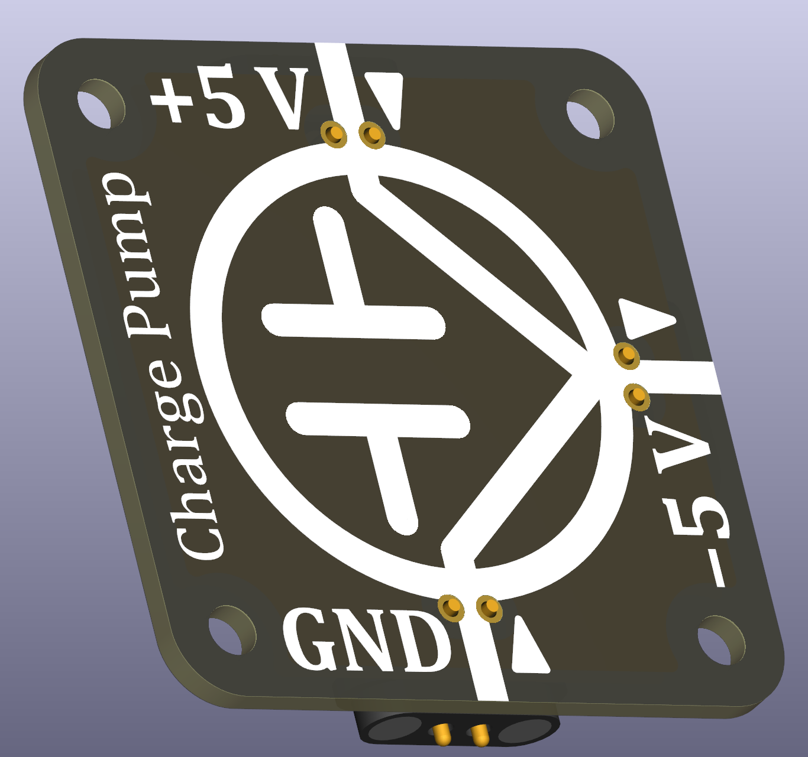

# Charge Pump Inverter (THT)

A charge-pump inverter converts a positive supply voltage into a corresponding negative voltage using capacitors and a high-frequency switching network. It is useful in classrooms for demonstrating how DC voltages can be level-shifted or inverted **without** inductors, making the underlying principle easy to observe and explain.

 

Charge Pumps do not have a dedicated symbol and are typically displayed with the bare components and IC. Since this is didactically not feasible herein, I invented a schematic symbol based on the schematic symbol of a (hydraulic) pump -- circle and large wedge -- and added a capacitor to it as well as indicated the flow directions, highlighting the input voltage levels and output voltage levels.

## Typical uses in circuits
- Generating a **–5 V** supply from a standard +5 V rail for experiments with operational amplifiers.
- Demonstrating **negative voltage generation** without inductors.
- Supplying simple analog circuits in “dual-supply” configurations (+5 V / GND / –5 V).
- Teaching switched-capacitor concepts and basic DC-DC conversion.

## Practical and safety notes
- The inverter can supply only **limited current**; loads below ~150 mA are recommended.  
- Larger output capacitors improve stability but increase inrush current at startup.
- Expect small amounts of ripple on the negative output due to the switching mechanism.
- Even though the board includes input protection, students should still adjust power supplies carefully.

# Essential parts (core charge pump)

These components form the functional DC-to-negative-DC converter:

- **Core IC:** LM2776 or compatible 2 MHz charge-pump inverter  
- **Input capacitor:** 10 µF X7R, 10–16 V 0805 or 1206
- **Flying capacitor:** 2.2–4.7 µF X7R 0805 or 1206
- **Output capacitor:** 4.7–10 µF X7R 0805 or 1206

These values improve stability and load behaviour while remaining fully within the LM2776 specifications.

# Recommended safety & protection parts

These components harden the module against common student errors (reverse polarity, overvoltage, accidental misconfiguration) without interfering with the functionality:

- **Reverse-polarity protection:** P-channel MOSFET (e.g., AO3401A)  
- **Over-voltage protection:** Bidirectional TVS diode, ~6 V standoff (e.g., SMF6.0CA)  
- **Short-circuit protection:** Polyfuse (PTC) on the input for additional abuse resistance, see dedicated polyfuse Circuit Node

These parts are not strictly required for operation but significantly increase longevity and safety in classroom environments. If you do **not** require internal safety (because you have other external safety), you can bridge the solder jumper and leave the safety parts unpopulated.
