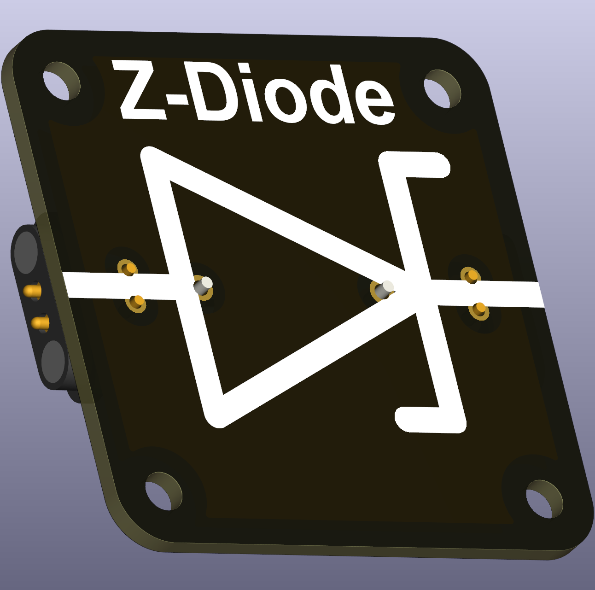
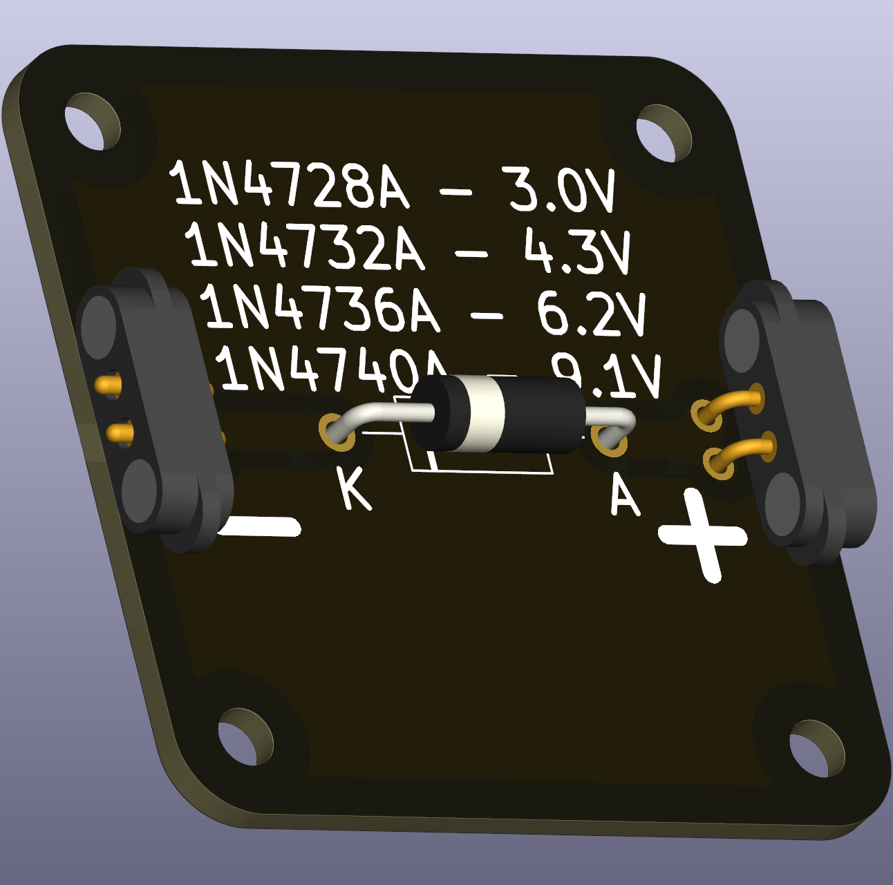

# Zener diode (THT)

A Zener diode is optimised to hold a nearly constant reverse voltage once its breakdown (Zener) voltage is reached. It is commonly used for simple voltage regulation and reference circuits in classroom demonstrations.

 

## Typical uses in circuits
- Simple voltage regulation and reference for small-signal experiments.
- Teaching the concept of breakdown voltages and regulation.

## Practical and safety notes
- Zener diodes must be used with a series resistor sized so the diode operates within its safe power dissipation. A useful design equation is:

\[R = \frac{V_{\text{supply}} - V_{\text{Zener}}}{I_{\text{desired}}}\]

- Check the device’s power rating (e.g., 0.5 W, 1 W) and avoid sustained operation near the maximum dissipation in student experiments.

## Recommended parts
- Small-signal Zener diodes in DO‑41 or similar packages are convenient for demonstrations. The part numbering often reflects standard E‑series steps.
