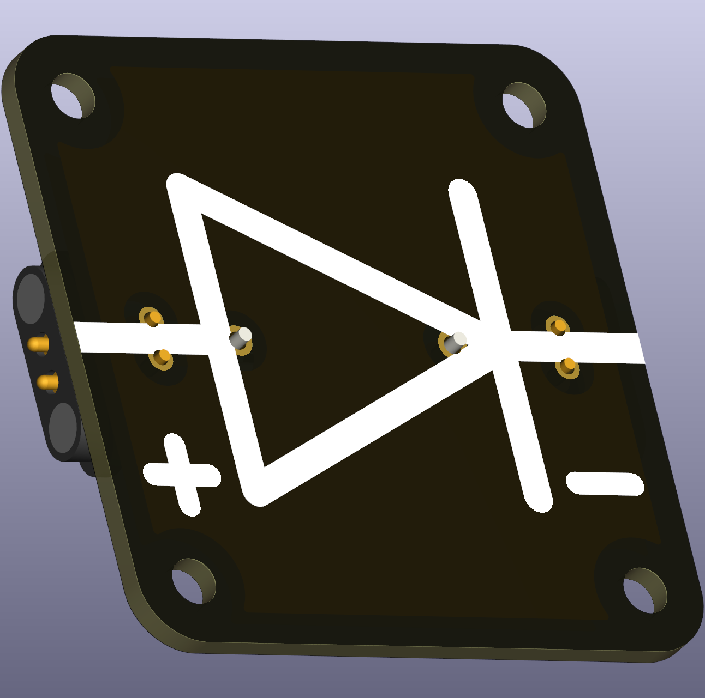
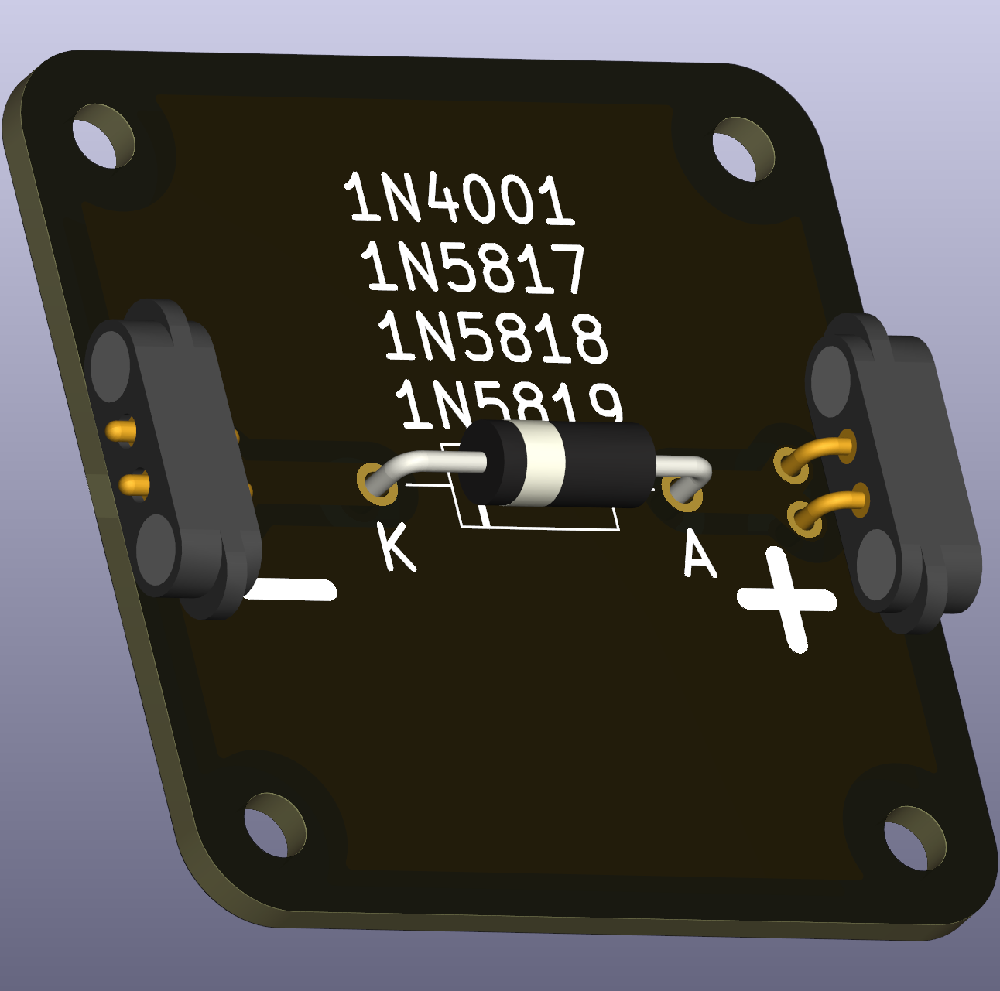

# Intro  
A **diode** is a component that only allows current to flow in one direction and blocks currents in the other direction. Diodes are used for reverse voltage protection, AC-to-DC rectifiers, voltage stabilization and many more.

Diodes come in different flavors, depending which parameter should be optimized. In school settings, those differences are likely not important and general purpose diodes are concidered. This puzzle piece supports a wide range of THT diodes.

 

Diodes only allow current to flow in **one direction** (from the **Anode (+)** to the **Cathode (-)**). They require **a resistor in series** to limit current and prevent damage. Diodes are used 

# Current Limiting Required
Diodes must be used with a **series resistor** to prevent excessive current. 
The resistor value can be calculated using Ohm’s Law:  

\[R = \frac{V_\text{supply} - V_\text{forward}}{I_\text{max,diode}}\]

 Diodes have a maximum current based on their package size (effective dissipation capacity). Diodes with DO-35 package have maximum current of approx. 0.2A and DO-41 1A, etc.

# Recommended Parts

Many diodes will work with this part. The recommended package size is DO-41 (or larger), as the maximum allowed current is 1A (or higher). One standard diode is 1N4001, which has a very low leakage current ~5µA, but relatively high forward voltage ~0.7V. Alternatively the (Schottky) diode 1N5817, 1N5818 or 1N5819 is recommended which has a higher leakage current ~1mA, but low forward voltage ~0.3V