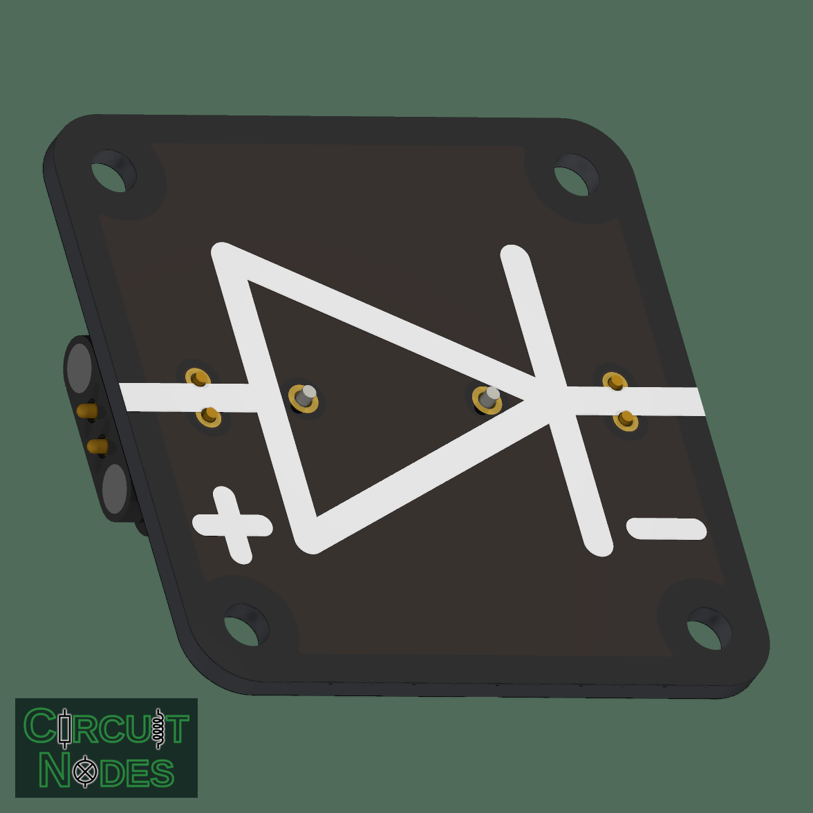
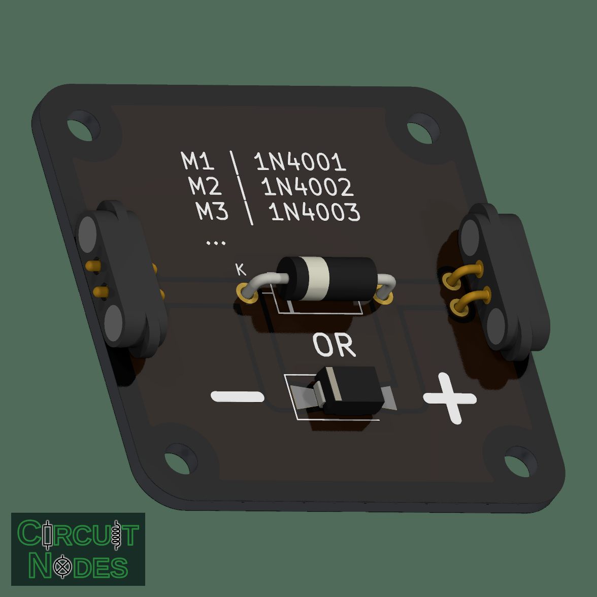

# General-purpose silicon diode (THT or SMT)

This node demonstrates one-way conduction, rectification, and the forward voltage of a standard silicon diode. Fit an axial THT diode or an SMT diode on the same board.

 

## Parts and assembly

The silkscreen lists **M1 / 1N4001**, **M2 / 1N4002**, and **M3 / 1N4003**, followed by an ellipsis for the remaining family members.

| SMT / THT pair | Maximum repetitive reverse voltage |
| --- | --- |
| M1 / 1N4001 | 50 V |
| M2 / 1N4002 | 100 V |
| M3 / 1N4003 | 200 V |
| M4 / 1N4004 | 400 V |
| M5 / 1N4005 | 600 V |
| M6 / 1N4006 | 800 V |
| M7 / 1N4007 | 1,000 V |

These are nominally 1 A standard silicon rectifiers; allowable continuous current.

**Populate either THT or SMT, not both**, as indicated by the printed **OR**. The footprints are connected in parallel. Match the diode's cathode band to **K**; the other terminal is **A**, the anode.

- **SMT:** the board uses `D_SMA-SMB_Universal_Handsoldering`. Select M1–M7 parts in SMA / DO-214AC and verify their recommended land pattern against the universal pads.
- **THT:** 1N4001–1N4007 parts are normally axial DO-41. This PCB uses the larger `D_DO-15_P12.70mm_Horizontal` footprint for enough headroom.

**M7 / 1N4007** is a convenient default pair. M1 / 1N4001 already provides reverse-voltage headroom for 20 V experiments. The catalog component-face image shows both assembly options using the footprints' generic models; fit only one diode on the physical board.

## Teaching the forward-voltage drop

A standard silicon diode typically drops **approximately 0.7 V at modest forward current**. This is a useful classroom approximation, not a fixed threshold.

Connect several diode nodes in series to show that their forward drops add. At approximately the same current, one, two, and three diodes may produce roughly **0.7 V, 1.4 V, and 2.1 V**. Use a current-limited source or adjust the external series resistor to keep the comparison current approximately constant.

## Typical uses in circuits

- Demonstrate one-way conduction and series forward-voltage drops.
- Rectify slow AC signals, including half-wave and bridge-rectifier experiments.
- Demonstrate signal steering and series reverse-polarity protection.

## Operating notes

The diode **does not** limit current by itself. Where an external resistor sets the current, use `R = (V_supply − sum(V_forward)) / I_desired` and choose an adequate resistor power rating.
