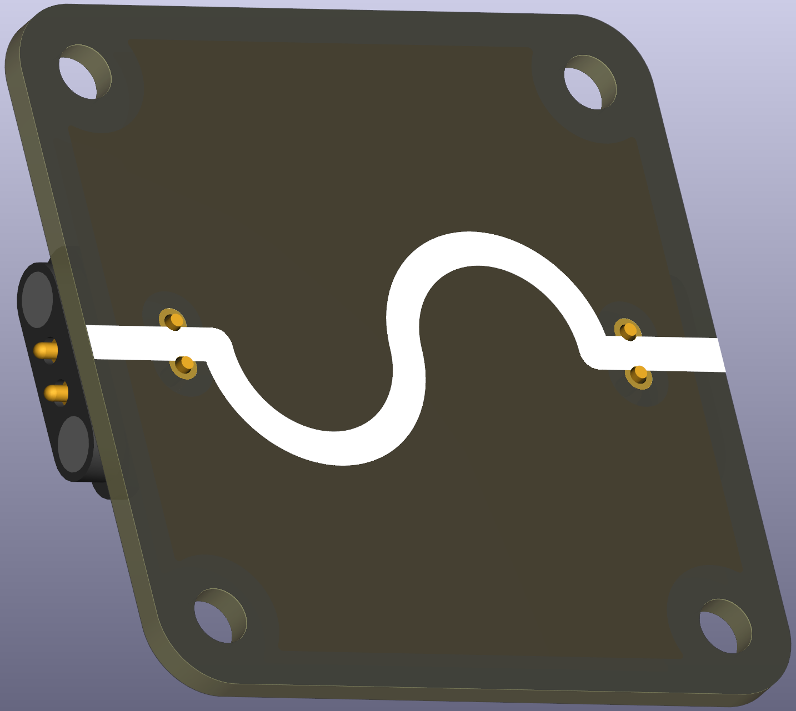
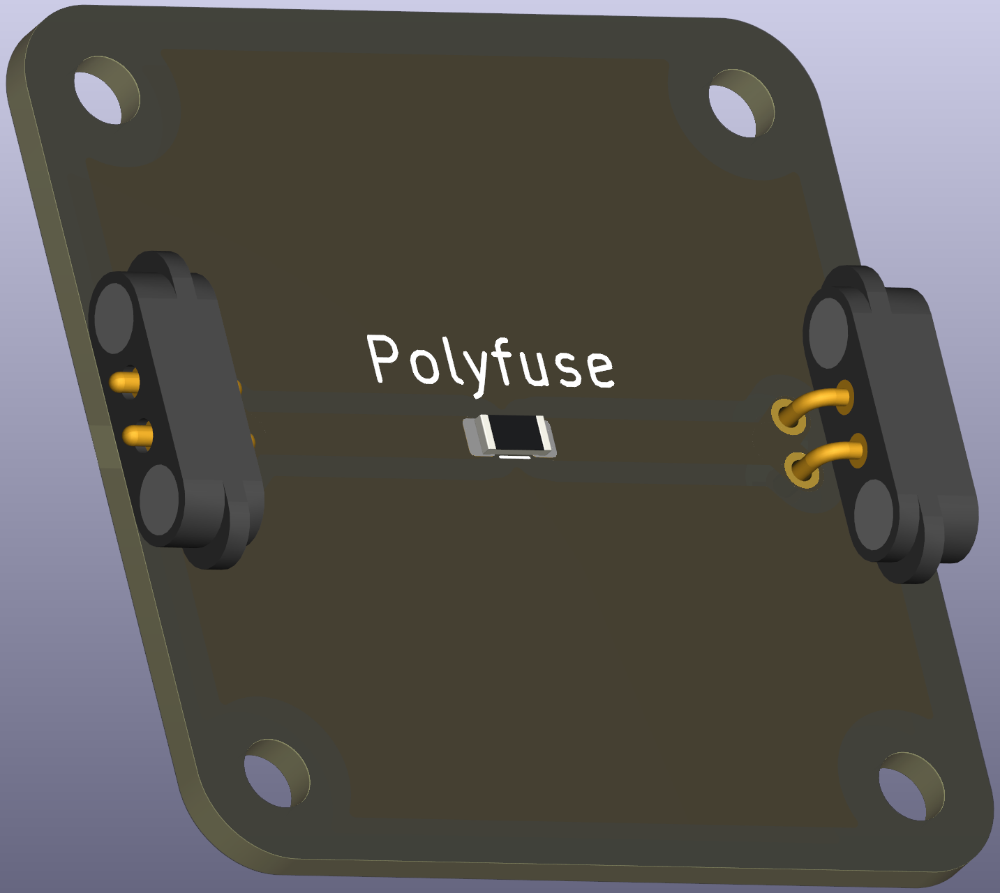

# Intro  
A polyfuse, also known as a resettable fuse, is essentially an optimized positive temperature coefficient (PTC) resistor. Strictly speaking, this type of “fuse” does not cut the circuit entirely; instead, it increases its resistance to such a high level that current flow is drastically reduced, so in practice nothing damaging usually happens. Two important specifications define its behavior: the hold current—the maximum current the device can continuously carry without tripping at room temperature—and the trip current—the level at which the polyfuse definitely transitions into its high-resistance state under the same conditions.

Compared to classical single-use fuses, polyfuses offer several advantages. They are available in much lower current ratings (down to the milliampere range rather than whole amperes), making them suitable for protecting delicate educational circuits. Even more importantly, they are self-resetting: once the overcurrent condition is removed and the component cools down, the polyfuse returns to its low-resistance state without needing replacement. This makes them cost-effective and convenient in repeated use, such as in teaching laboratories. The main trade-offs are their relatively imprecise tripping current and the finite time required to respond, which is typically not a problem in school or demonstration setups where sudden catastrophic failures are unlikely.

 

# Compatibility
or school experiments, a polyfuse in surface-mount (SMT) size 1206 is usually a practical choice. Selection should be based both on the expected current range and the available handling equipment. Since typical classroom experiments only involve very small currents (a few milliamperes), nearly any polyfuse rated with a hold current of around 100 mA or higher will be sufficient.

It is important to note, however, that polyfuses are not suitable for protecting every kind of component. Because even in their tripped state they continue to allow a small current to flow, very sensitive parts—such as LEDs or diodes connected without current-limiting resistors—may still be damaged before the polyfuse fully reacts. Thus, they should be seen as a general safeguard against misuse and short circuits, not as a precise protection mechanism for fragile semiconductor devices.

# Experiment with PolyFuse
Polyfuses rely on the PTC effect: their resistance increases sharply as they heat up. The self-heating process is governed by the relation
\[P=I^2\cdot R(T),  \]

where $I$ is the current and $R(T)$ is the resistance as a function of temperature. At low temperatures and normal operating currents, their resistance remains small, resulting in minimal power dissipation and negligible heating. However, when the current rises significantly, the heat generated within the device raises its temperature, which in turn increases the resistance further. This creates a positive feedback loop until the device enters its high-resistance “tripped” state.

This behavior makes polyfuses an excellent demonstration tool for students. They can be used in experiments to visualize how a self-protecting circuit element responds dynamically to overload. By deliberately creating a mild short circuit, learners can observe how the circuit continues to function but with strongly reduced current flow, and how the polyfuse eventually recovers once it cools. Such hands-on demonstrations help bridge abstract electrical safety concepts with tangible experimental experience.