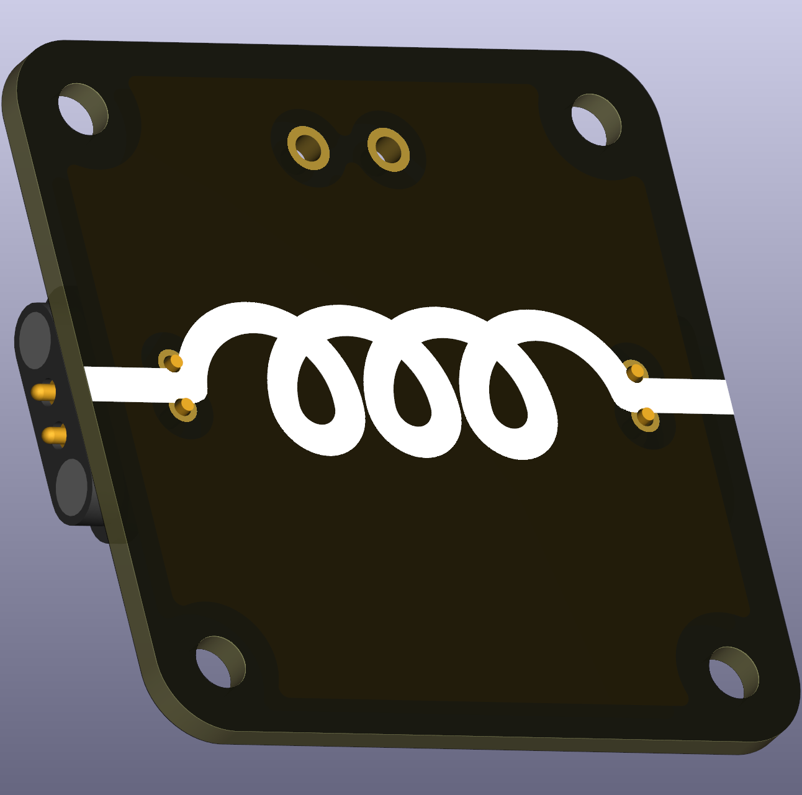

# Intro  
An **inductance** is in its simplest form a coiled wire. Currents flowing through a wire generate a magnetic field around this wire. This magnetic field results in counter-electromotive forces caused by electromagentic inductance.

The voltage-current relation of a inductance follows 

\[U(t) = L \frac{\text{d}I(t)}{\text{d}t}\]

For school settings without differentials and integrals, the differentials can be replaced with the pre-differential idea of a simple difference $\text{d}t \approx \Delta t = t_2 - t_1$.

 