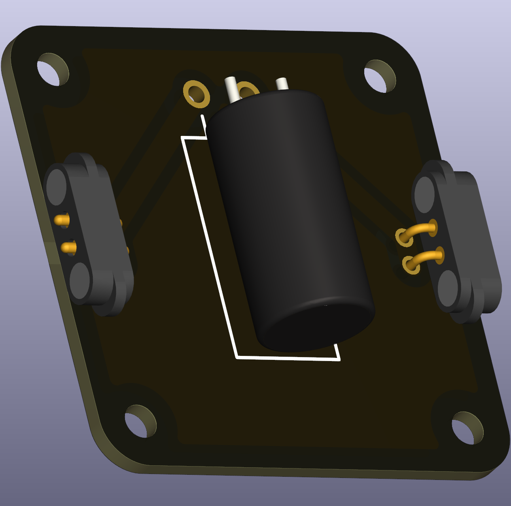

# Inductance (THT)

An inductance (coil) stores energy in a magnetic field when current flows and produces a voltage opposing changes in current. In classroom demonstrations it is useful to show transient responses and the behaviour of RL or RLC circuits.

 

## Typical uses in circuits
- Demonstrating inductive kick, RL time-constants, and filtering when paired with capacitors.

## School-level description
- The basic relation is
	\[U(t) = L \frac{\mathrm{d}I(t)}{\mathrm{d}t},\]
	which you can describe qualitatively as: a sudden change in current creates a voltage across the coil that opposes that change.

## Practical and safety notes
- Inductors have current limits because of wire heating; do not exceed the rated current for the part.
- Significant inductive effects (fast transients) often require oscilloscopes or fast measurement tools; for beginner labs choose larger inductances or slower changes so a multimeter can show average effects.

