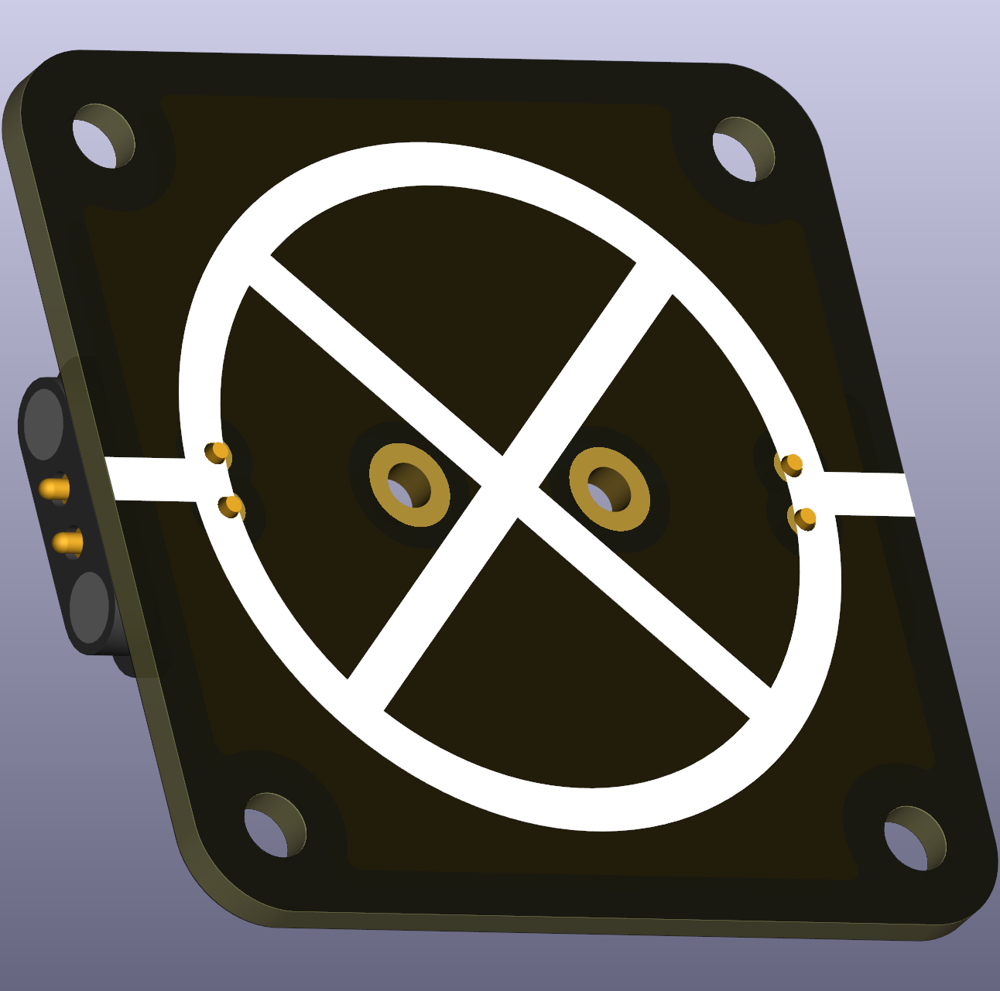

# Lamp (E10, THT)

A small E10 lamp makes electrical effects visible through light and heat, and is a useful demonstration component in early lessons. Unlike a simple resistor, the filament’s resistance typically increases with temperature, so lamp behaviour is nonlinear.

  

## Typical uses in circuits
- Visual indicator for current flow in simple series circuits and for illustrating thermal effects in resistive elements.

## Didactical notes
- Use lamps to discuss non-linear resistance and to compare steady-state and startup current behaviour (cold filament has lower resistance and draws higher current initially).

## Practical and safety notes
- Select lamp voltage to match your supply to avoid excessive current or rapid burnout.
- LED-based E10 bulbs are polar and behave differently from incandescent lamps; treat them as diodes and use a series resistor when appropriate.

