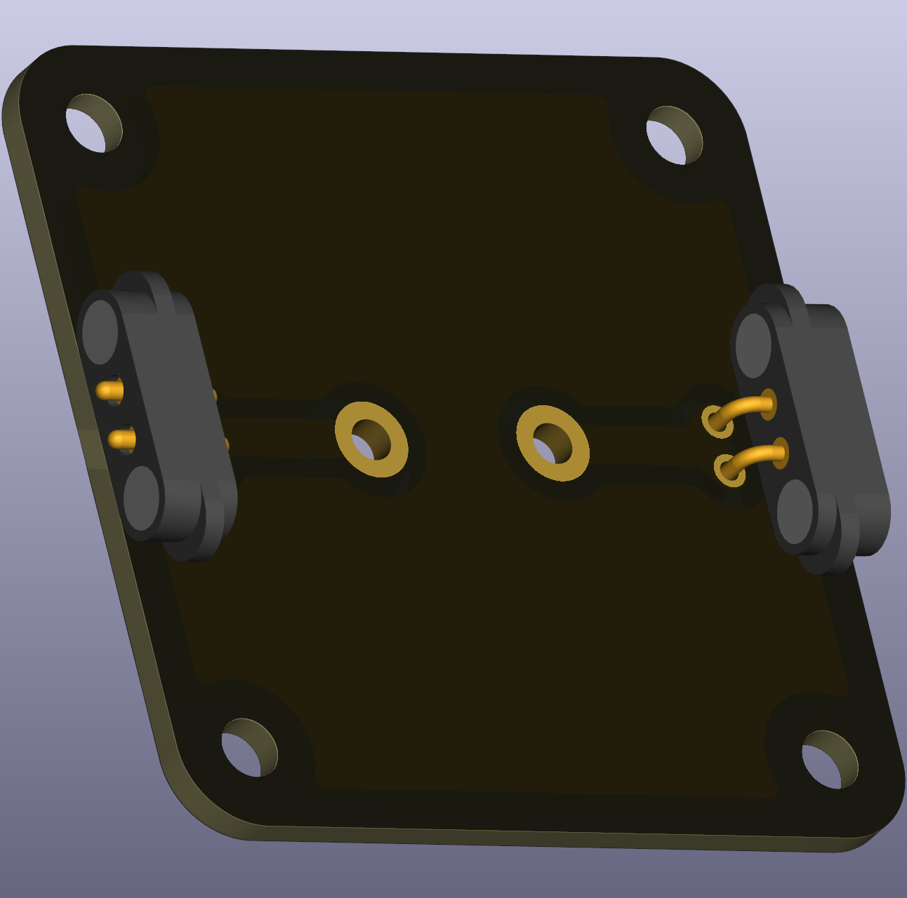

# Intro  
A **lamp** is the intro component in education as it makes "invisible" electricity visibly via light and heat emmission. It **limits the flow of electric current** and thereby producing heat, like a resistor.   
Resistors follow **Ohm's Law (V = I × R)**. Lamps are slightly special, **their resistance increases** with temperature, $R(T)$, thereby feathering the limit of heat dissipation and current flow.

 

# Compatible lamps

This board is meant for bare-metal THT lamp holder for small E10-sized lamps. E10 lamps come in different voltages. Pick the lamps that suits your supply voltage the best. 

**Be cautious with LED E10 lamps**, they are oftentimes polar, i.e. current can only flow in one direction through an LED but not in reverse. The standard schematics of a lamp does not consider polarity, and neither does this simple part.

