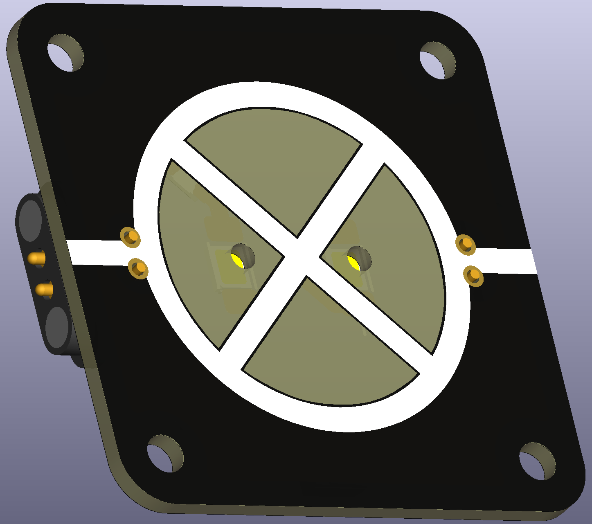
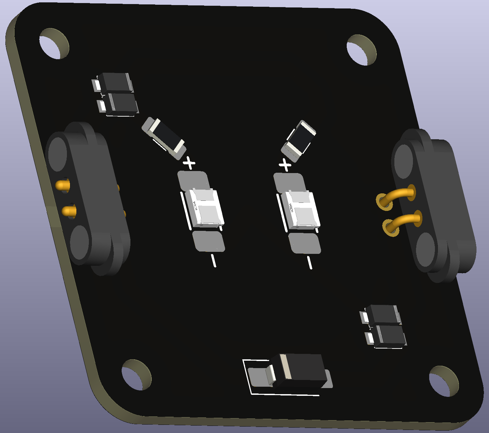

# Lamp (ruggedized LED)

A lamp is the ideal starting component for electronics. Unfortunately, the tiny E10 lamps and sockets are oftentimes of questionable quality. A ruggedized LED can be used as alternative to a lamp.

 

# Usage

A reverse mounted large LED in the inside with protection, over-voltage diodes and reasonably large resistor in series can act as a lamp replacement in terms of functionality. LEDs have much longer life than typical E10 lamps, so you can expect that these ruggedized LED lamps will last for ages.