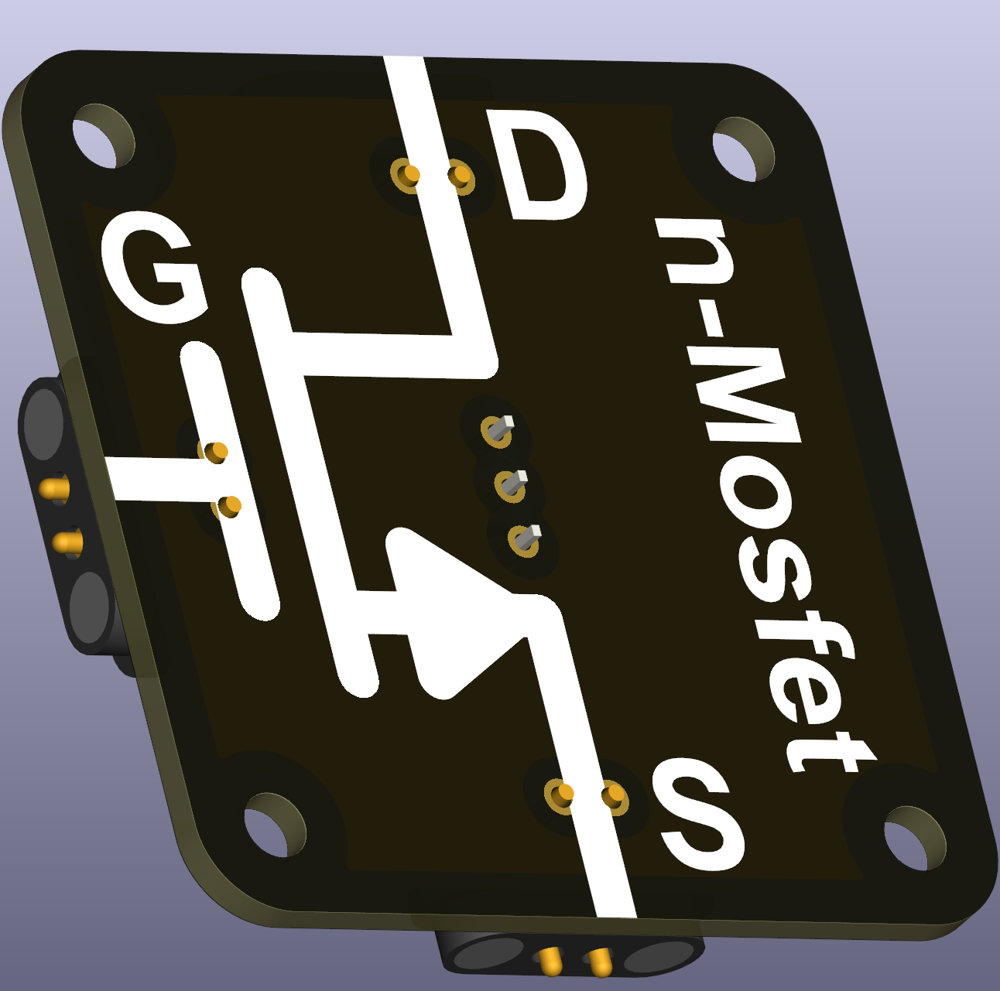
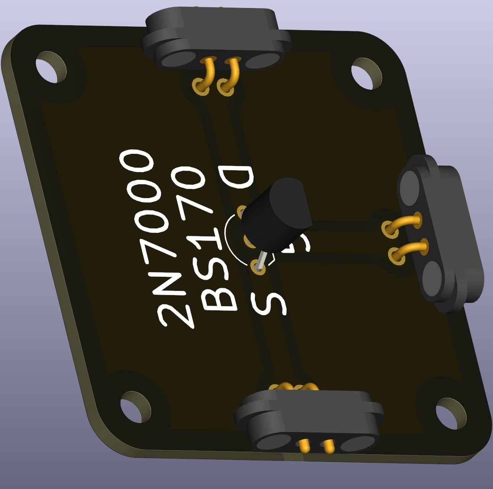

# N-channel MOSFET (TO-92)

An N‑channel MOSFET is a semiconductor switch controlled by a gate voltage. It is widely used for efficient switching of currents in low-side configurations and is an excellent device to introduce switching concepts in class.

 

## Functional description
The device has three terminals:

| Terminal | Function |
|---|---|
| Drain (D) | Current enters |
| Source (S) | Current exits |
| Gate (G) | Voltage that controls conduction |

- Gate low (near 0 V): MOSFET is off (blocks current).  
- Gate high (above threshold): MOSFET turns on and allows current from drain to source.

## Typical uses in circuits
- Low-side switching for motors, LEDs, and small loads.  
- Teaching efficient power switching and MOSFET behaviour compared to BJTs.

## Didactical notes
- Compare a MOSFET and an NPN transistor in class to show voltage‑driven vs current‑driven control.

## Practical notes
- Use logic‑level MOSFETs when driving from microcontroller voltages. Check pinout because TO‑92 packages vary.

## Recommended parts
- Common, easy-to-find parts for teaching: 2N7000, BS170.
