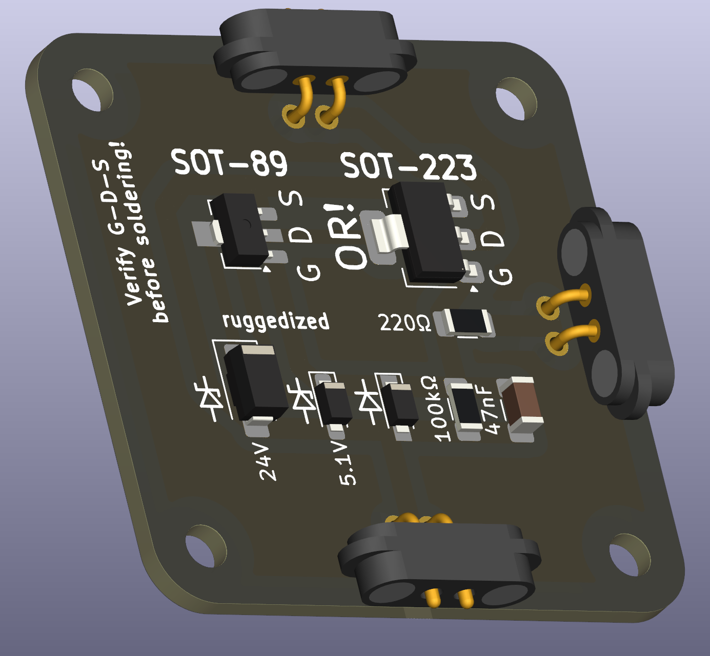

# N-channel MOSFET (ruggedized)

An N‑channel MOSFET is a semiconductor switch controlled by a gate voltage. It is widely used for efficient switching of currents in low-side configurations and is an excellent device to introduce switching concepts in class.

 

## Functional description
The device has three terminals:

| Terminal | Function |
|---|---|
| Drain (D) | Current enters |
| Source (S) | Current exits |
| Gate (G) | Voltage that controls conduction |

- Gate low (near 0 V): MOSFET is OFF (blocks current).  
- Gate high (above threshold): MOSFET turns ON and allows current from drain to source.

## How It Works

This switch acts as a **low-side transistor driver**:

- **S (Source):** Connect to the system ground.  
- **D (Drain):** Connect to the load’s return. Load positive should be from your power source (e.g., 5–20 V).  
- **G (Control):** Logic control input (e.g., MCU GPIO, pushbutton output).

## Protection built in

- **Gate protection:**  
  - 5.1 V zener from Gate → Source clamps excessive positive gate voltage.  
  - 1N4148 diode from Source → Gate clamps negative gate swings.  
  - 220 Ω series resistor slows transient injection into the gate.  
  - 100 kΩ pulldown to ground keeps the MOSFET off when control is floating.

- **Drain-Source clamp:**  
  - 24 V zener across Drain → Source absorbs spikes or wrong wiring stress.  
  - Upstream resettable fuse limits energy under sustained fault.

This combination allows the MOSFET to survive common wiring mistakes (e.g., swapping control/GND/VIN) without immediate failure.

## Parts List (BOM)

| Ref     | Function                         | Value / Part                     |
|---------|----------------------------------|----------------------------------|
| Q1      | Main N-MOSFET                    | NDT3055L (SOT-223)               |
| R1      | Gate series resistor             | 220 Ω, 1206                      |
| R2      | Gate pulldown                    | 100 kΩ, 1206                     |
| D_GS_Z  | Gate positive zener              | 5.1 V, SOD-123                   |
| D_GS_D  | Gate negative clamp              | 1N4148W, SOD-123                 |
| D_DS_Z  | Drain-Source clamp (rugged)      | 24 V zener, SMA (1 W)            |

Substitute any logic-level part with:
- **VDS ≥ 30 V**
- Low **RDS(on) @ VGS ≤ 5 V**
- Same pinout (G/D/S)

## Limitations & Safety

- This piece is designed for educational demonstrations with reasonable current loads (≤ a few amps).  
- Gate protection will **not** protect against arbitrarily high voltages or sustained fault currents without an upstream fuse.  
- Always provide proper upstream overcurrent protection (PTC / fuse) when using this in student circuits.