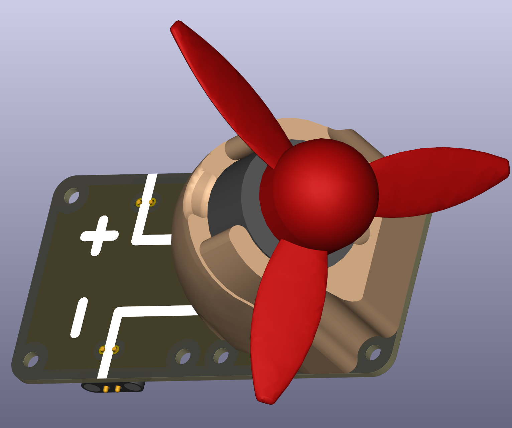
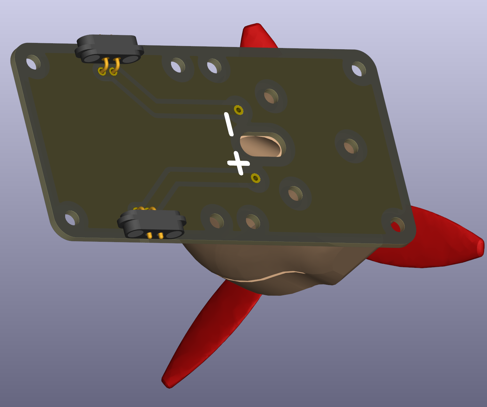

# Motor with Propeller

Like a lamp, a DC motor is a illustrative component of transforming electricity in a different energy form. Here, a simple motor with 24mm base and shaft for propeller mount is used, found in various entry level electronics kits. Many DC motors run in opposite direction, when polarity is switched, and others have reverse polarity switch and can only run in one directiong (like AC motors).

 

## Mounting

The 3D printable mount for motor comes with three slots for heat inserts.