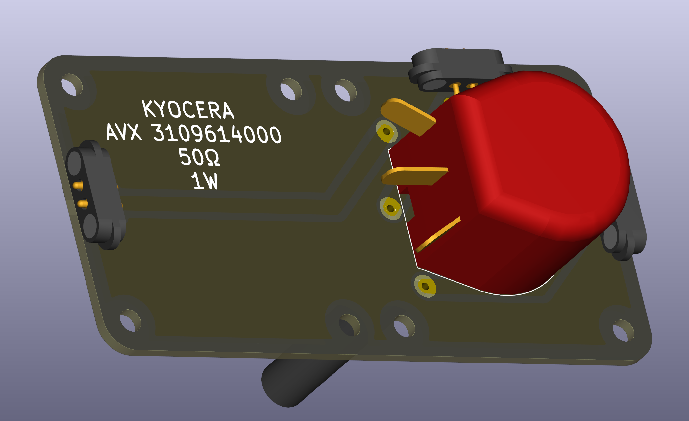

# Potentiometer — High Power

A  potentiometer is a mechanical variable resistor with a rotating shaft that changes the resistance between terminals. It is commonly used as a user-adjustable voltage divider (e.g., volume, brightness, or level controls) and for fine manual adjustments in experiments and demo circuits. 

*This is the rotary high power potentiometer version with bottom-side mounting for illustrating the schematic symbol.*

 

## Basic description

A potentiometer usually has three terminals: two fixed end terminals and one wiper (middle terminal). When used as a variable voltage divider the wiper provides an adjustable output between the two end terminals. When one end terminal is left disconnected the potentiometer acts as a variable resistor between the wiper and the remaining end.

## Typical uses in circuits
- User-adjustable voltage divider (volume, brightness, contrast)
- Manual offset or trim control in simple analog circuits
- Teaching component for demonstrating potentiometers and voltage division

## Wiring, Fixating and formulas
- Voltage divider when wired between `V_in` and `GND` with the wiper as output `V_out`:

	\[V_{out} = V_{in} \cdot \frac{R_{w}}{R_{total}}\]

	where `R_w` is the resistance from the wiper to ground and `R_total` is the total potentiometer resistance.

- As a variable resistor (rheostat) connect one end and the wiper; the resistance between them changes with the slider position.
- M2 screws for fixating the potentiometers should be secured and of correct length. Thread depth is approx 2mm, so 4mm M2 screws will usually fit. Take care of the correct applied torque to not strip the screws.
- *The potentiometers are quite tall*. **A printable base with large cut-out in the center should be used.**

## Why High Power Potentiometer
Usual potentiometers can only dissipate a few tens of milli Watts. This can dissipate 1-2 W, depending on model. This allows a few more use cases of voltage and power regulation than smaller potentiometers without introducing more complex parts for voltage and power regulation (mosfets, etc.) to the students.

Further, high power potentiometers are often available with lower resistance ratings, making them viable for circuits that require lower resistances. Standard potentiometers are usually 10k or 100k Ohms.
