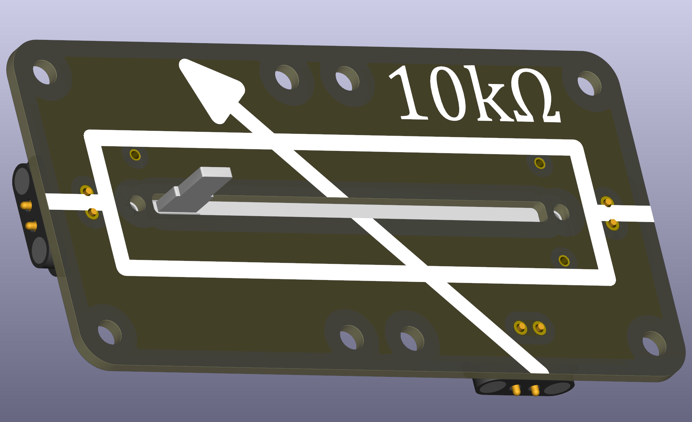

# Potentiometer — Slider (THT)

A slider potentiometer is a mechanical variable resistor with a moving wiper that changes the resistance between terminals. It is commonly used as a user-adjustable voltage divider (e.g., volume, brightness, or level controls) and for fine manual adjustments in experiments and demo circuits. 

*This is the slide potentiometer version with bottom-side mounting for illustrating the schematic symbol. There are also rotary potentiometer and top-side mounting versions available.*

 

## Basic description

A potentiometer usually has three terminals: two fixed end terminals and one wiper (middle terminal). When used as a variable voltage divider the wiper provides an adjustable output between the two end terminals. When one end terminal is left disconnected the potentiometer acts as a variable resistor between the wiper and the remaining end.

## Typical uses in circuits
- User-adjustable voltage divider (volume, brightness, contrast)
- Manual offset or trim control in simple analog circuits
- Teaching component for demonstrating potentiometers and voltage division

## Wiring, Fixating and formulas
- Voltage divider when wired between `V_in` and `GND` with the wiper as output `V_out`:

	\[V_{out} = V_{in} \cdot \frac{R_{w}}{R_{total}}\]

	where `R_w` is the resistance from the wiper to ground and `R_total` is the total potentiometer resistance.

- As a variable resistor (rheostat) connect one end and the wiper; the resistance between them changes with the slider position.
- M2 screws for fixating the potentiometers should be secured and of correct length. Thread depth is approx 2mm, so 4mm M2 screws will usually fit. Take care of the correct applied torque to not strip the screws.
- *The slider potentiometers are quite tall*. **A printable base with large cut-out in the center should be used.**

## Practical and safety Notes
- Power dissipation: **potentiometers are not designed for high power**; check the rated wattage and avoid using them to drop large voltages at high current. Use a fixed resistor or a potentiometer rated for power if needed.
- Taper: potentiometers come in **linear or logarithmic (audio) tapers**. Log-taper provides better resolution at the end of a travel move, however, linear taper is perhaps pedagogically better.
- Contrarily to other electronic components, **potentiometers are not cheap**, they should be handled with more care than simple resistors etc.

## Common values and recommendation for classroom
- Common values: `1 kΩ`, `5 kΩ`, `10 kΩ`, `50 kΩ`, `100 kΩ`.
- **Many reliable potentiometers are for audio applications**, e.g. slider potentiometers vor volume control etc.
- For instance, slider with 10kΩ and linear resistance taper: Alpsalpine RS45111A900F

## Classroom tips
- Use the potentiometer in a simple LED circuit with a series resistor to demonstrate how the wiper changes brightness.
- Show the difference between using the pot as a divider vs. as a variable resistor (leave one end floating for rheostat behaviour).

