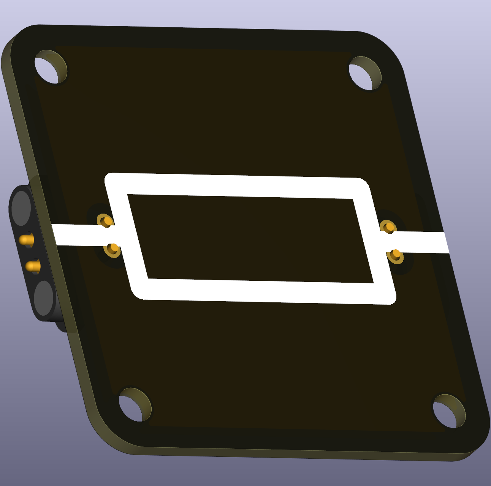
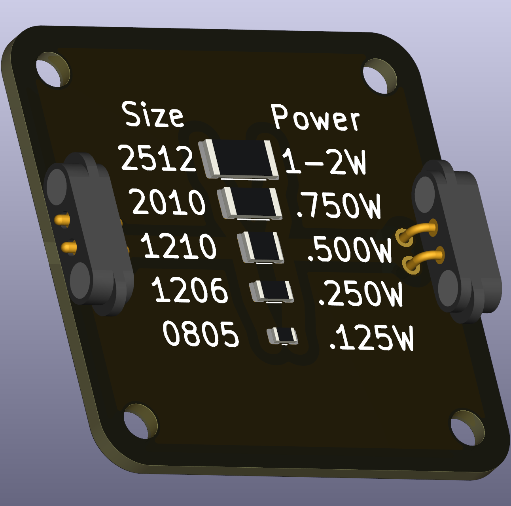

# Resistor (SMT)

An SMT resistor is a compact passive component used to set currents and voltages in circuits. For school-level explanations we use Ohm’s law:

\[U = I \cdot R\]

where $U$ is voltage (V), $I$ is current (A) and $R$ is resistance (Ω).

 

## Typical uses in circuits
- Current limiting (e.g., protecting LEDs).
- Voltage dividers for simple references.
- Basic signal conditioning in combination with capacitors or inductors.

## Practical and safety notes
- Power dissipation: resistors convert electrical energy to heat. Use the formula
  \[P = U \cdot I = I^2 \cdot R = \dfrac{U^2}{R}.\]
  Choose resistor power ratings appropriate for expected dissipation; in low-voltage classroom experiments this is often not critical but remains good practice.

## E-series (preferred values)
- Resistors are manufactured in preferred-value E-series (for example E12 or E24). These series explain the commonly available standard values (10, 12, 15, 18, 22, 27, 33, … etc.). Use the E-series as a teaching point for availability of component values.

## Classroom kit recommendations
- Keep a range from a few ohms up to 1 MΩ to support different experiments; include standard values such as 100 Ω, 330 Ω, 1 kΩ, 10 kΩ, and 100 kΩ.
