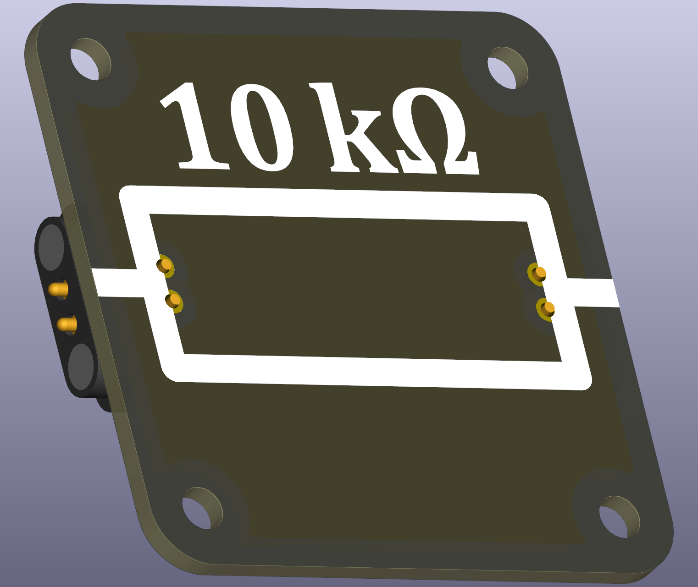
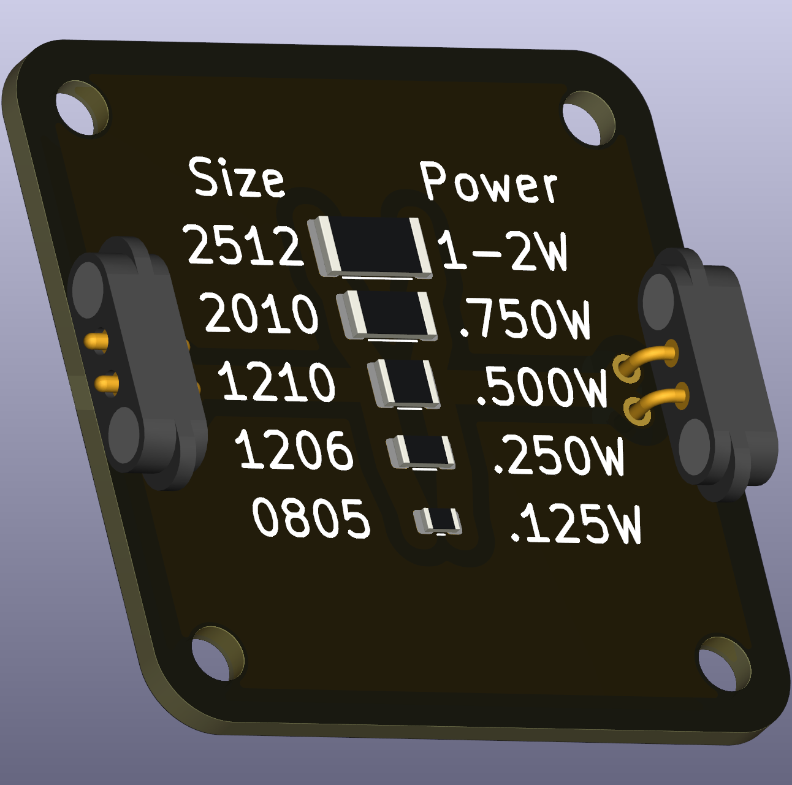

# Intro  
A **resistor** is one of the most fundamental electronic components. It **limits the flow of electric current** and is used to control voltage and current in a circuit. 
Resistors follow **Ohm's Law (U = I × R)**, meaning the voltage drop across the resistor is proportional to the current flowing through it. 

**This set here includes the printed resistor values as silkscreen.** Pick the right zip file for the right resistor value you need. I included the KiCAD project, so users can create missing values for their specific needs.

 

# For What It Is Used  
**Resistors are commonly used in:**  
- **Current limiting:** Preventing excessive current in LEDs and other components.  
- **Voltage division:** Creating reference voltages by dividing a supply voltage.  
- **Signal conditioning:** Adjusting or filtering signals in electronic circuits.  
- **Heat generation:** Converting electrical energy into heat in applications like heaters and braking systems.  

# Important Considerations  

⚠️ **Power Rating Matters!** A resistor dissipates power as heat:  

$ P = UI = I^2 R = \frac{U^2}{R}$

If the power rating is exceeded, the resistor **may overheat and burn out**. 

⚠️ **Tolerance:** Real resistors are not perfect; they have a tolerance (e.g., ±5%) indicating variation from their labeled value.

# Compatible and Recommended Part(s)  
SMT pads of various sizes for resistor will work, as displayed. *Only one pad pair must be used.* I recommend using ones with lower tolerances, 1%, and high wattage/heat dissipationW. Those resistors are usually bulky and survive very long, e.g. 2512. 
For school settings and various experiments, you want to have a broad range of resistances. 300Ω is a reasonable resistance for LEDs at lower voltages. 1MΩ is a reasonable resistance when charging a capacitor and make it visible on minute time scale.

Resistors do not come in all resistances imaginable, but follow **E series of preferred numbers** multiplied with an order of magnitude, colour coded in all resistors. The E series is a geometric progression of values on amlogarithmic scale. For most school settings, the E3 series is sufficient with 3 values per decade: **1.0, 2.2, 4.7,** 10.0 and so on...
See Wikipedia for all other E-series: https://en.wikipedia.org/wiki/E_series_of_preferred_numbers
