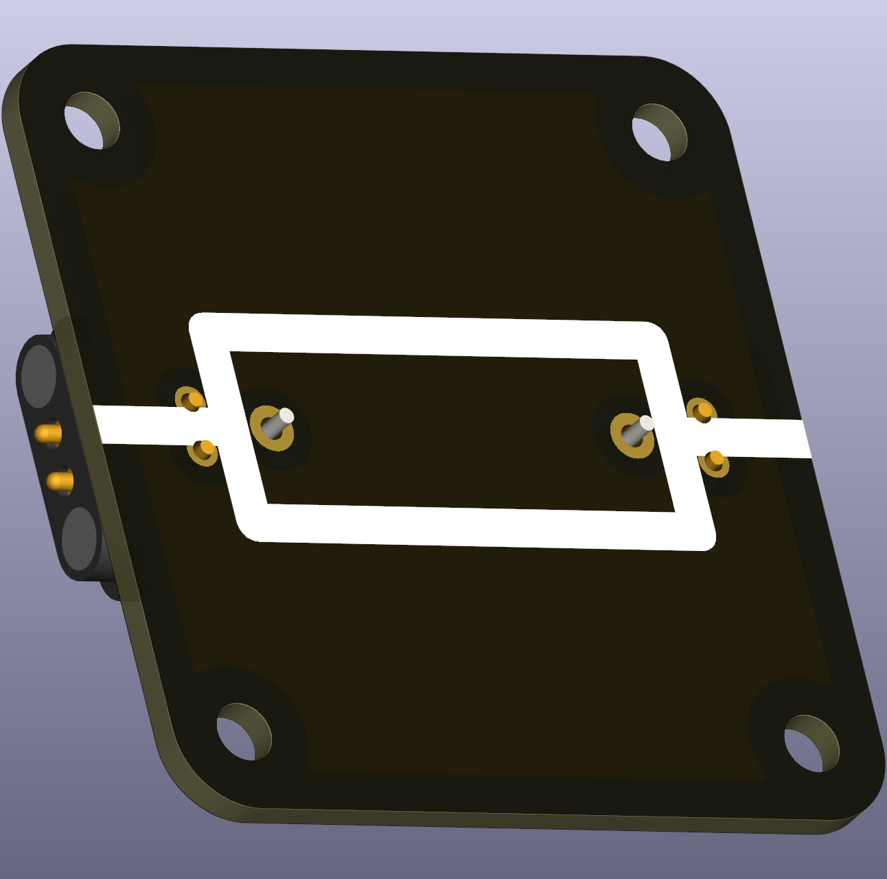
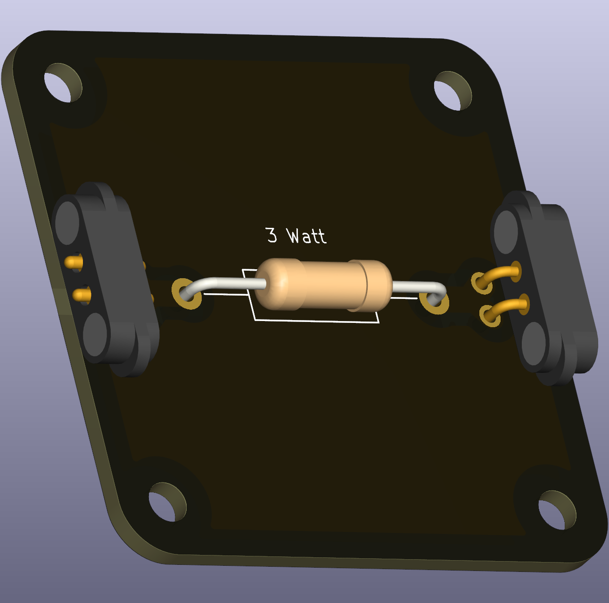

# Resistor (THT, 3 W)

A high‑power through‑hole resistor for experiments where significant power dissipation is needed (heaters, load demonstrations, or current-limiting at higher voltages). Resistors obey Ohm’s law:

\[U = I \cdot R\]

 

## Typical uses in circuits
- Current limiting for higher-voltage experiments, power-dissipation demonstrations, and as adjustable loads in teaching setups.

## Practical and safety notes
- Power dissipation: calculate power with
	\[P = U \cdot I = I^2 \cdot R = \frac{U^2}{R}.\]
	Ensure the chosen resistor’s wattage rating (e.g., 3 W) exceeds expected dissipation in experiments.
- For classroom work keep voltages and currents within safe limits and allow resistors to cool between runs.

## E-series and value selection
- Resistors are produced in preferred-value series (E-series). For classroom kits E12 or E24 series are common. The E-series explains why standard values (e.g., 10, 22, 47, 100, etc.) are readily available.

## Classroom kit recommendations
- Keep a selection covering a wide range (from hundred ohms up to 1 MΩ) depending on the experiments planned.

