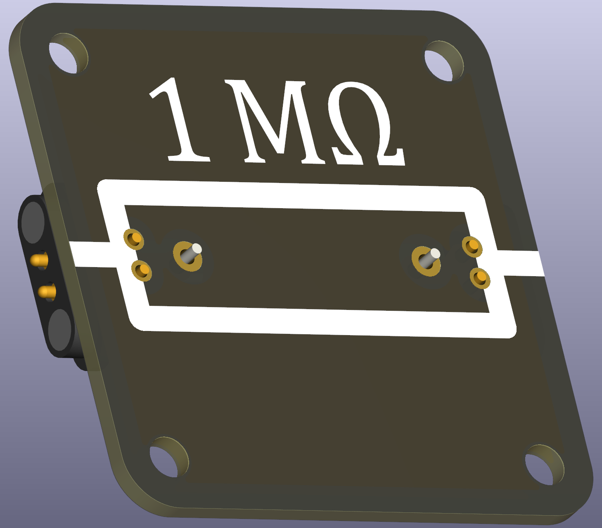

# Resistor (THT, printed value set)

This set provides THT resistors with values printed on the silkscreen for easy identification in classroom kits. Use these when learners should quickly identify component values without reading small SMD markings.

 

## Typical uses in circuits
- The same uses as standard resistors: current limiting, voltage division, signal conditioning, and power-dissipation demonstrations.

## Practical and safety notes
- Power dissipation: calculate with
	\[P = U \cdot I = I^2 \cdot R = \dfrac{U^2}{R}\]
	Ensure the chosen resistor wattage (e.g., 3 W) is adequate for the experiment.

## E-series and kit recommendations
- Prefer standard E-series values (E3/E6) when planning kits. Keep a selection that spans from a hundred ohms to 1 MΩ for diverse classroom experiments.

