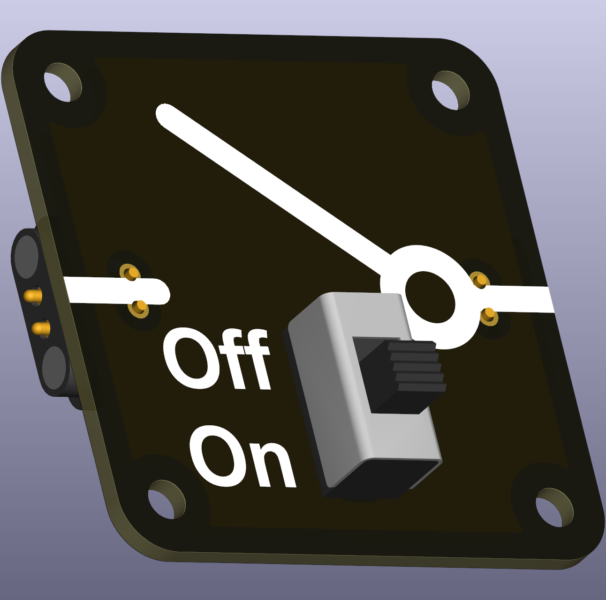

# Intro  
A simple switch with two positions, ON and OFF, as indicated. The mounting holes support a wide variety of larger (slide) switches that can withstand high currents and tens of thousands of uses.

 