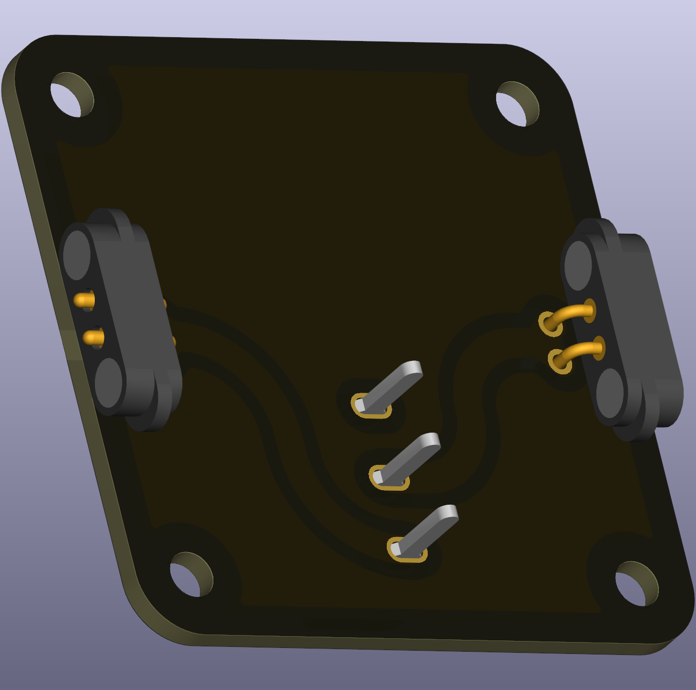

# Switch — On / Off (THT)

A simple two-position on/off switch footprint for common slide or toggle switches. Ideal for introducing switching and control in classroom projects.

 

## Typical uses in circuits
- Powering or isolating a circuit section during experiments.

## Didactical notes
- Use to demonstrate the concept of open and closed circuits and the effects on current and voltage measurements.

## Practical notes
- Check the switch's current rating before using with higher-power experiments.