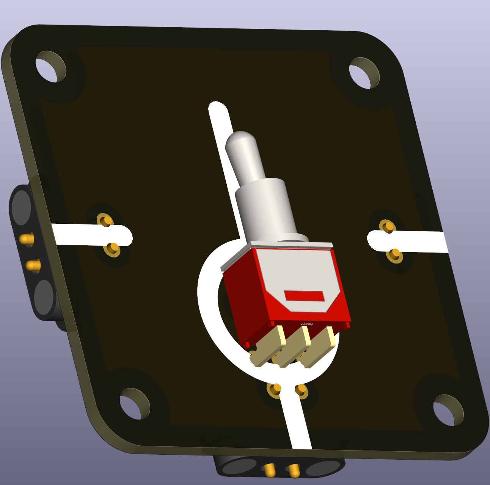

# Switch — On1 / Off / On2 (THT)

A three-position switch (On1, Off, On2) useful for selecting between two circuits or disconnecting the circuit entirely. The footprint accommodates common larger switches suitable for heavier classroom loads.

 

## Typical uses in circuits
- Selecting between two outputs while providing an explicit off position for safe testing and measurement.

## Didactical notes
- Use this switch when teaching the effect of open circuits and for stepwise comparison between two configurations.

## Practical notes
- Ensure the switch's mechanical and electrical ratings suit the intended classroom loads.