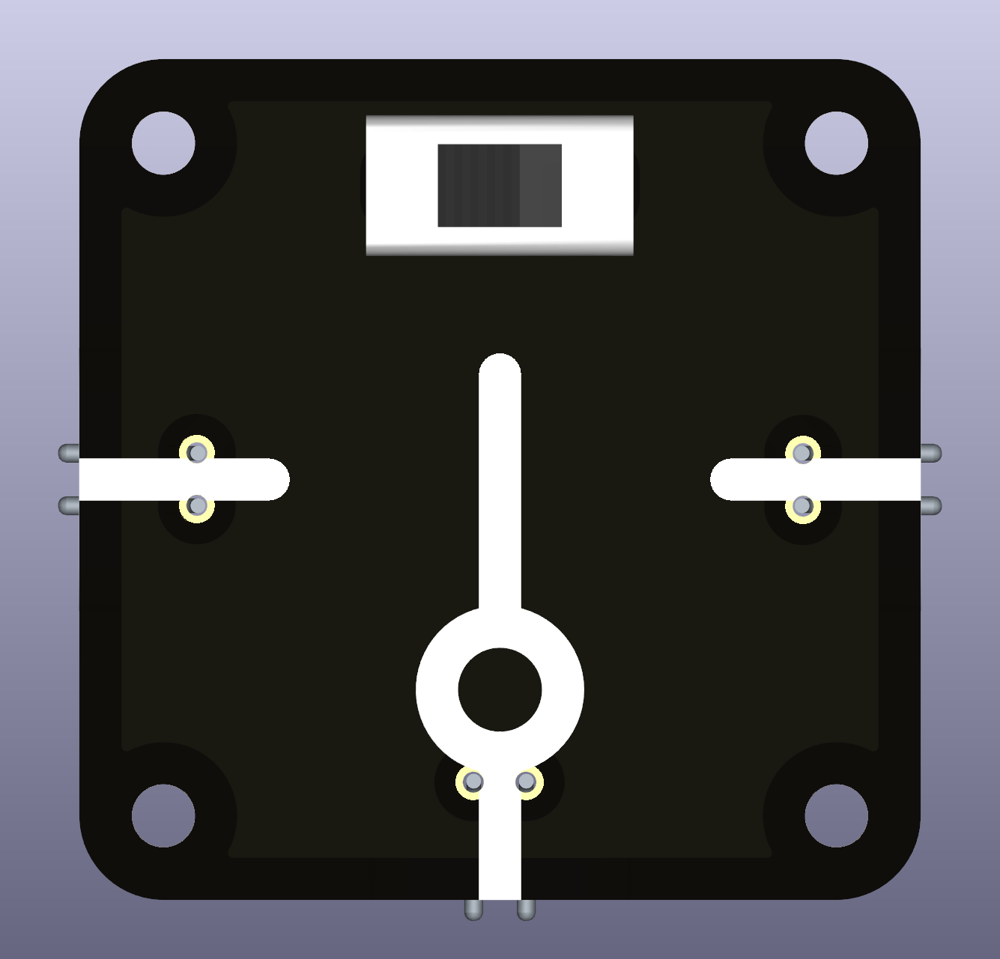

# Intro  
A simple switch with two positions, ON1 and ON2, as indicated. The mounting holes support a wide variety of larger flip switches that can withstand high currents and tens of thousands of uses. 

 