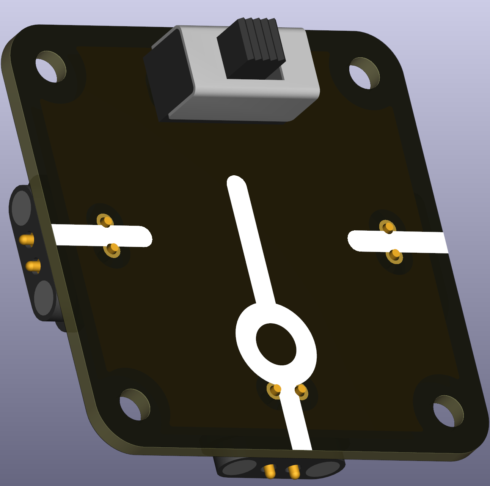
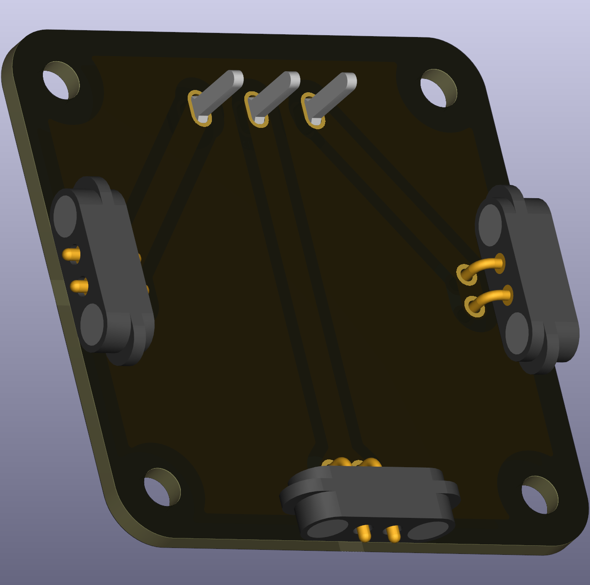

# Switch — On1 / On2 (THT)

A two-position switch that selects between two output paths (On1 or On2). The footprint supports common larger toggle or slide switches used in classroom demonstrations.

 

## Typical uses in circuits
- Selecting one of two outputs (e.g., routing a signal to different sensors or loads).

## Didactical notes
- Use this switch to demonstrate selection logic and to have students compare the behaviour of two different circuit branches under the same supply conditions.

## Practical notes
- Check the switch's current rating before using with motors or higher-power loads.