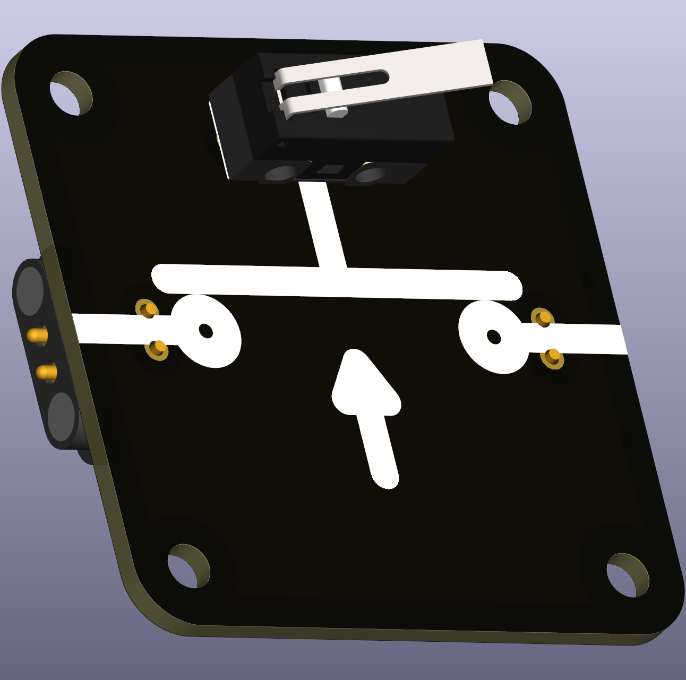
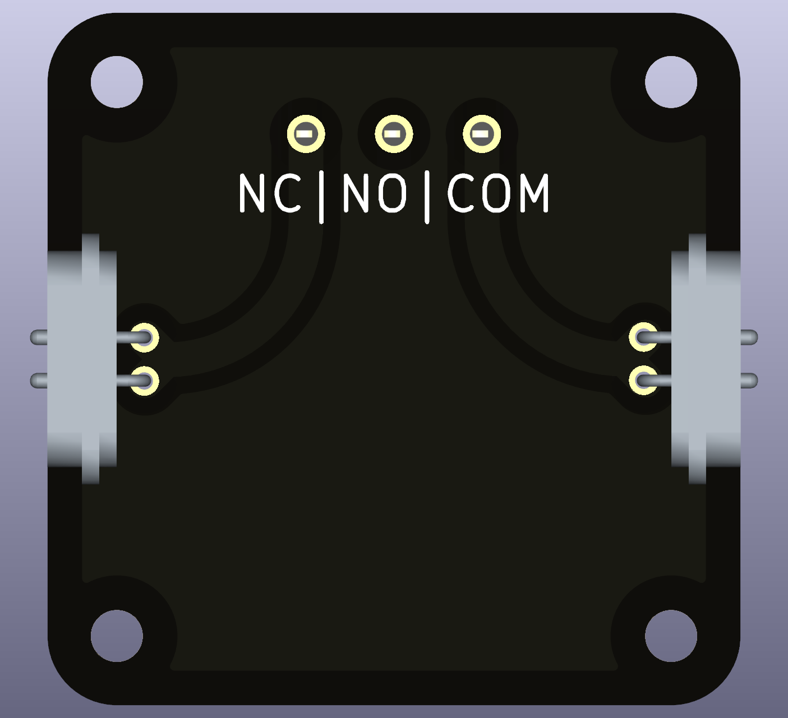

# Intro  
A simple (micro) switch with two positions, ON and OFF, as indicated. The mounting holes support a wide variety of typical micro switches that can withstand higher currents and tens of thousands of uses. When soldering them, the user should be accustomed to the typical naming and function of the three terminals, Com, NO (Normally Open) and NC (Normally Closed), and the order of the terminals. A button that opens the circuit when pressed, is in its non-pressed state *normally closed*, vice versa.

 