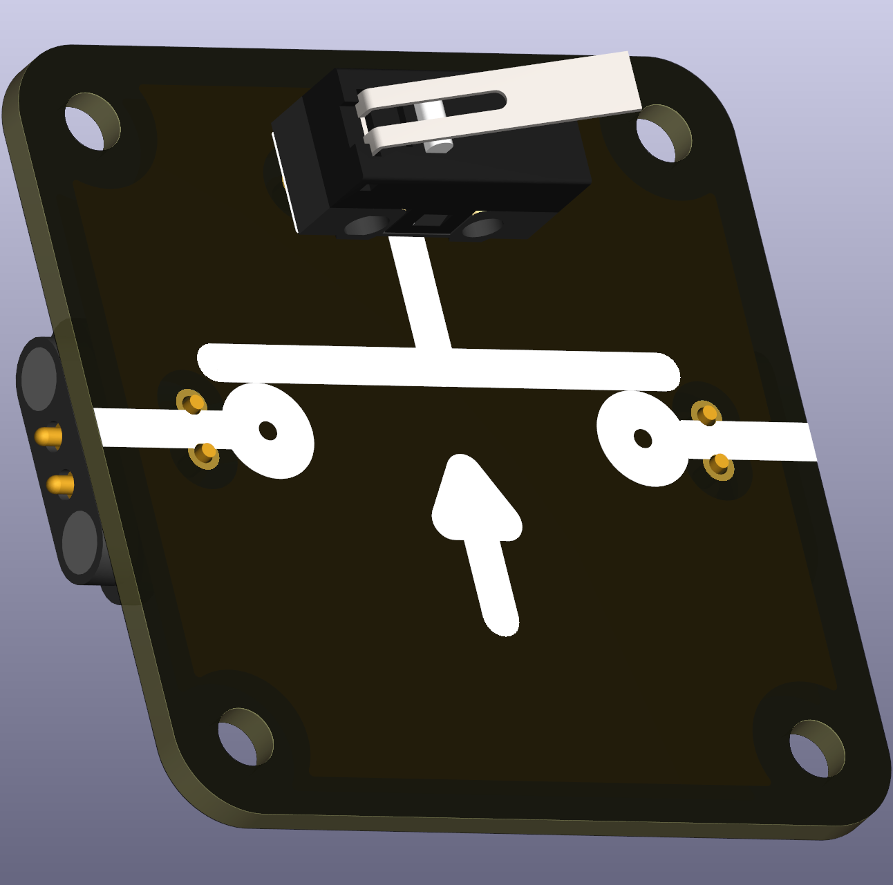
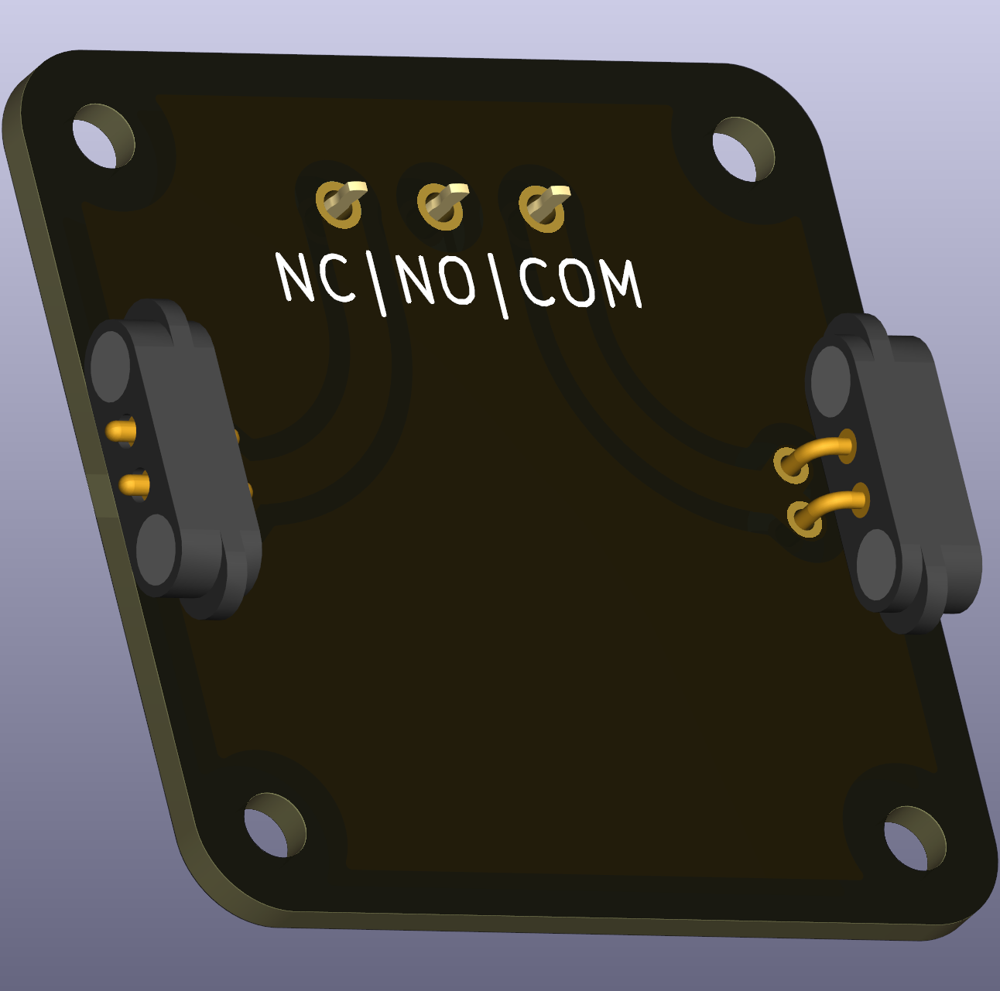

# Micro switch — Normally Closed (THT)

A small micro switch footprint for components that are *normally closed* (NC) when not actuated. These are common in user-interface and safety circuits and are durable for frequent actuation.

 

## Typical uses in circuits
- Safety interlocks, limit switches, or user input where the default closed state is desired.

## Didactical notes
- Use NC and NO micro switches in paired experiments to show how contact logic affects circuit behaviour.

## Practical notes
- Identify terminals (COM, NC, NO) before soldering; mounting orientation may vary between switch models.