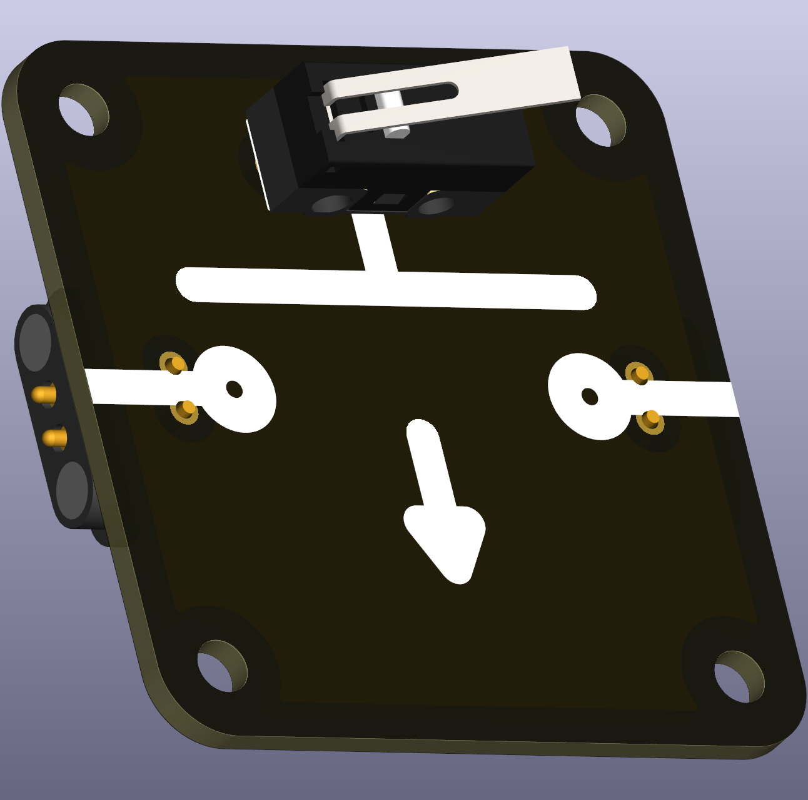

# Micro switch — Normally Open (THT)

A small micro switch footprint for components that are *normally open* (NO) when not actuated. These switches close the circuit when pressed and are useful for momentary inputs and simple controls.

 

## Typical uses in circuits
- Momentary buttons, debounced inputs, and simple user controls in classroom projects.

## Didactical notes
- Compare NO and NC switch behaviour in labs to illustrate contact logic and debouncing concepts.

## Practical notes
- Verify terminal labelling (COM, NO, NC) and test switch operation before final assembly.