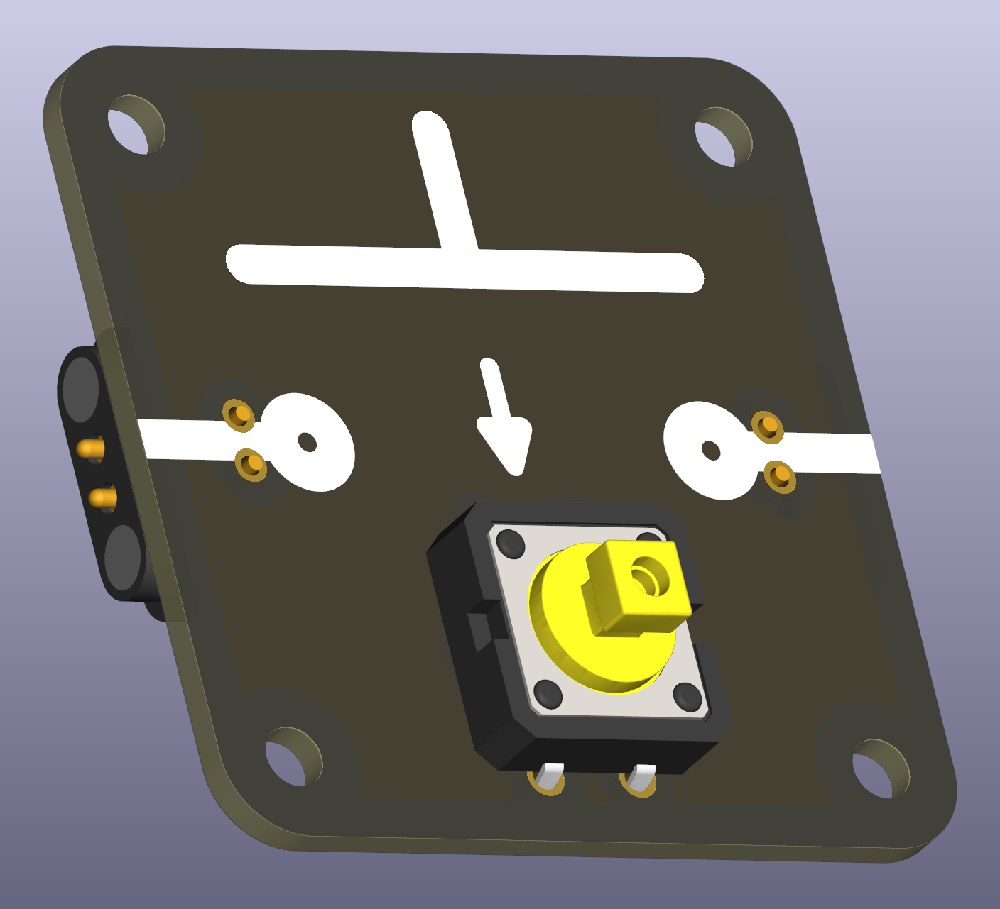
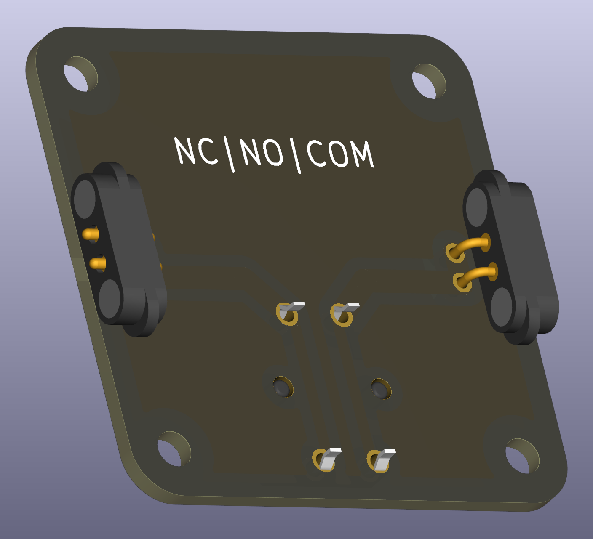

# Tactile Switch - Normally Open

A 12 x 12 mm tactileswitch footprint for components that are *normally open* (NO) when not actuated. These switches close the circuit when pressed and are useful for momentary inputs and simple controls.

 

## Compatible Components and Usage

Virtually all tactile switches with 12 x 12 mm footprint and THT are compatible. Cheap, no-name tactile switches are sufficient. If you prefer color-coordinated switches with higher durability, look for Omron switches. They come in different colors and are more robust.