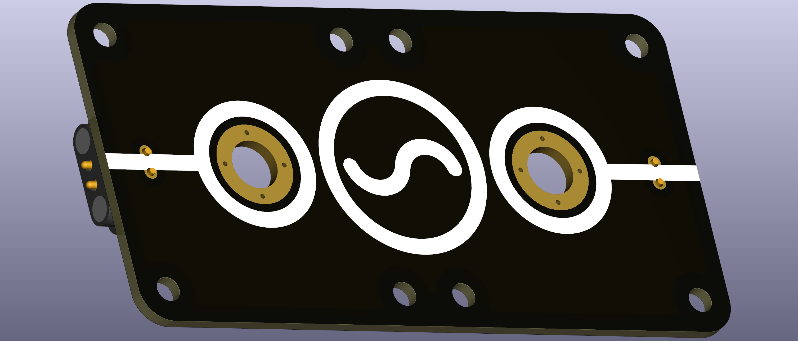
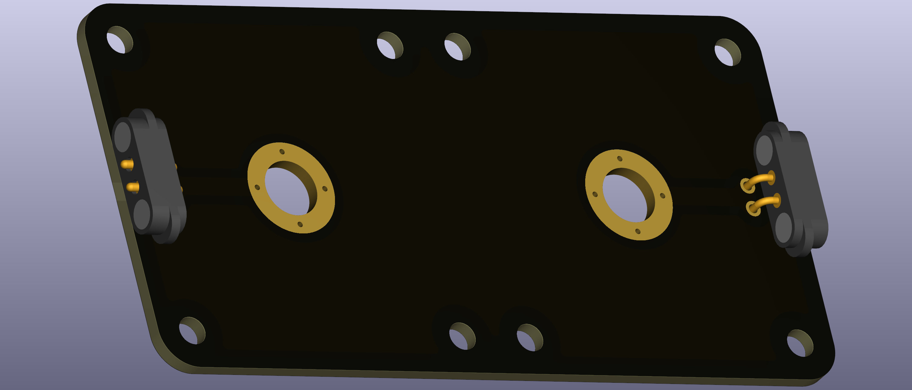

# AC Source End Node

This puzzle piece provides a connector for an alternating current (AC) source. It features M6-sized holes where banana plug terminals can be screwed in. Since AC has no dedicated positive or negative pole, it's conventional to use terminal colors different from the standard red (positive) and black (negative) used for DC sources—typically green or yellow to indicate AC.

  
