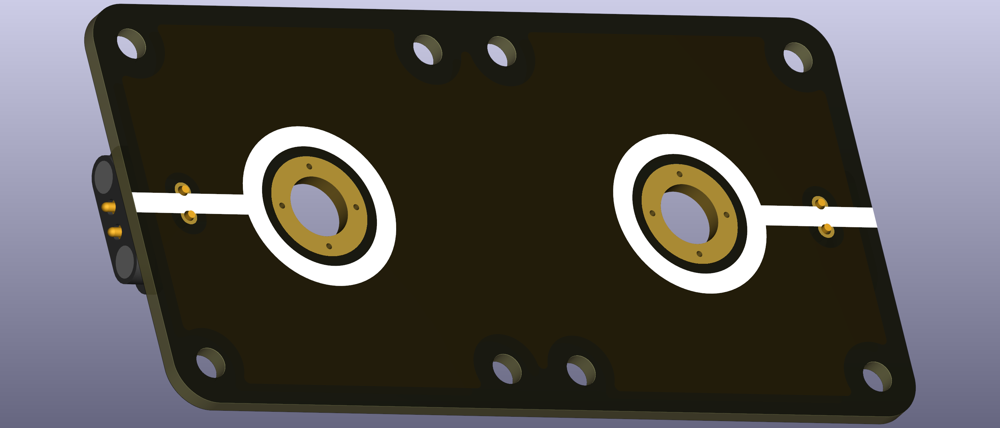

# Blank Double End Node

This puzzle piece provides two unlabeled connectors that can each serve multiple functions in a circuit. It features M6-sized holes where banana plug terminals can be screwed in, offering flexibility for custom configurations.

  
