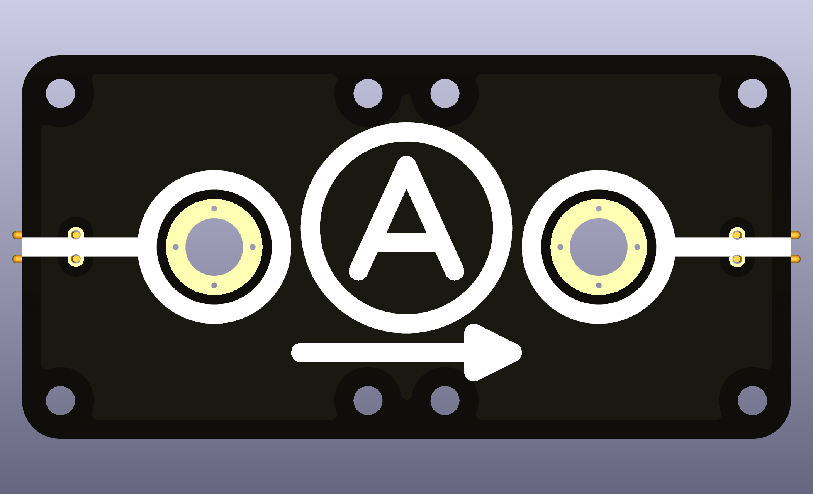

# Intro  
Circuit node with two end points indicated for Ampère-meter usage. It comes with M6-sized holes where typical banana plug terminals can be screwed in.

  

Note, most modern Ampère-meters can handle forward and backward currents equally, so technically the polarity is often not needed. Nonetheless, currents have a direction and are indicated here, as well it is bad practice not to care about directionality. The banana plug terminals should color-match for guiding students correspondingly ("currents flow from red to black").