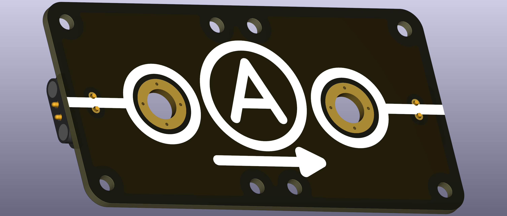
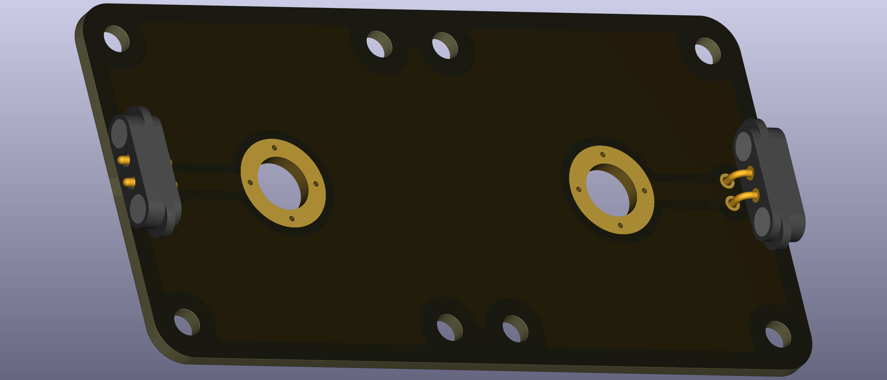

# Intro  
Circuit node with two end points indicated for Ampère-meter usage. It comes with M6-sized holes where typical banana plug terminals can be screwed in.

 

Note, most modern Ampère-meters can handle forward and backward currents, so technically the polarity is often not needed. Nonetheless, currents have a direction and are indicated here.