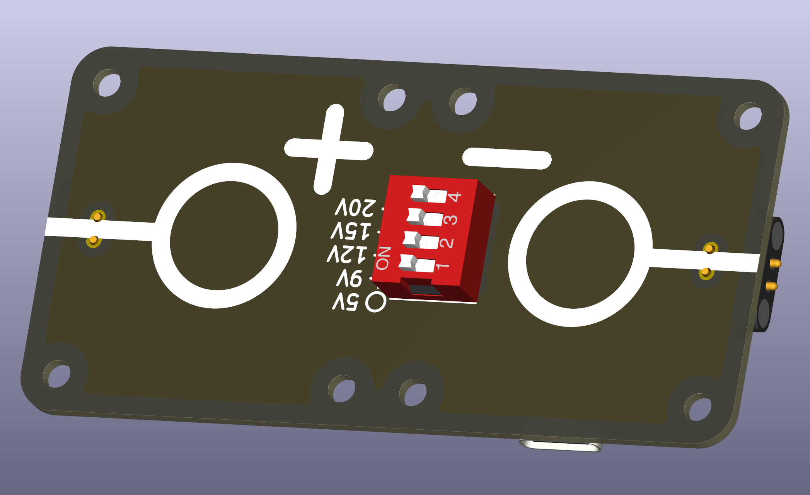
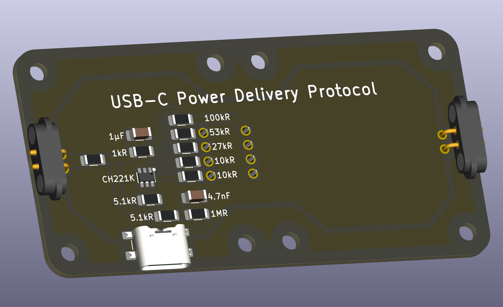

# DC Power Supply with USB-C Power Delivery

This puzzle piece provides a USB-C connector with integrated Power Delivery (PD) protocol support. Instead of soldering a large battery connector, you can plug in any modern USB-C charger (30W or higher recommended). The puzzle piece includes a small IC and resistor network to negotiate the desired voltage with your charger. A DIP switch lets you select between 5V, 9V, 12V, 15V, or 20V output. This is convenient but requires careful soldering of small SMT components—a heating plate is helpful.

 

## Soldering Guide

The components are labeled with generic names. Solder the components corresponding to the table:

| component | Value |
|-----------|-------|
| R1 | Resistor Size 1206, 1k Ohm |
| R2 | Resistor Size 1206, 10k Ohm |
| R3 | Resistor Size 1206, 10k Ohm |
| R4 | Resistor Size 1206, 27k Ohm |
| R5 | Resistor Size 1206, 53k Ohm |
| R6 | Resistor Size 1206, 100k Ohm |
| R7 | Resistor Size 1206, 5.1k Ohm |
| R8 | Resistor Size 1206, 5.1k Ohm |
| R9 | Resistor Size 1206, 100k Ohm |
| C1 | Capacitor Size 1206, 1µF |
| C2 | Capacitor Size 1206, 4.7nF |
| F1 | PolyFuse Size 1206, see PolyFuse piece, trip current 100-150mA |
| J2 | USB-C Receptible horizontal, SMT, 6 pins |

# USB-C Power Delivery Protocol "PD"
Power Deliver Protocol is a standard for requesting devined voltage levels. USB-C PD uses the CC1 and CC2 data line establish a "talk" between the IC and the USB-C charger. The DIP switch is used to configure which voltage the IC should request from The charger, 5V, 9V, 12V, 15V or 20V. The charger then outputs the requested voltage. If the requested voltage is not available by the charger, the charger will provide the next lower voltage available.

## How to use
To request a certain voltage, deactivate all switches of the requested voltage and lower voltages to "OFF", i.e.

| Requested Voltage | DIP to toggle |
|---------------------|-----------------------------------------|
| 5V | None |
| 9V | 1 |
| 12V | 1 + 2 |
| 15V | 1 + 2 + 3 |
| 20 | 1 + 2 + 3 + 4 |

## Recommended charger
Most newer charger will work. Some do not provide 12V (because 12V is only "optional" in the PD protocol standard). A charger with 30W or more is recommended. 