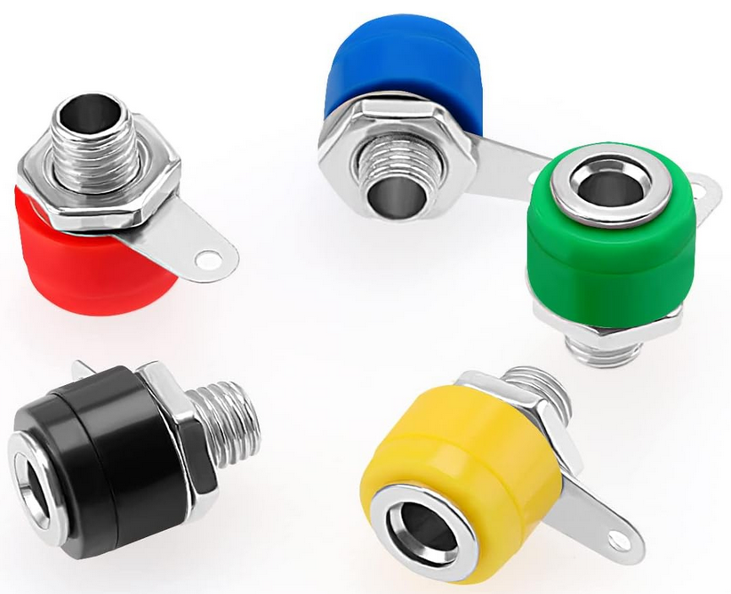

# DC Power Supply End Node with Protection

This puzzle piece provides two connectors for a DC power source plus integrated polyfuse protection and an indicator LED. The positive connector is red and the negative is black. The polyfuse automatically increases resistance if too much current flows through the circuit, offering protection similar to a traditional fuse but with the advantage of being self-resetting—no replacement needed after the overcurrent condition is resolved.

  

## Polyfuse Protection

A polyfuse is a positive temperature coefficient (PTC) resistor that automatically increases resistance when current exceeds a threshold. Unlike traditional fuses, it doesn't require replacement—it resets when the overcurrent condition ends. The "hold current" is the maximum current it can safely carry indefinitely. The "trip current" is where it starts to increase resistance. For school circuits with small currents (a few milliamps), any polyfuse with a hold current of ~100mA or higher will work. Note that a polyfuse may not fully protect sensitive components (like unprotected diodes) since it allows some current to flow even when tripped—always use a current-limiting resistor with sensitive parts.
